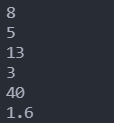

# Day 11 : 函式的介紹

學完前面的一些程式觀念後，我想來簡單說一下函式的概念。

函式(function)簡單來講就是一個小程式，將複數程式碼整理成一組程式，並且在需要取用時就可以直接呼叫，不用再重福撰寫一樣的程式碼，增加了程式的閱讀性以及方便維護。利用函式這種概念可以讓整個程式非常的模組化，讓整個程式有條有序。

要撰寫函式非常簡單，只要輸入以下格式:

```python
def 函式的名稱(參數):
    想要執行的程式碼
```

利用def可以宣告函式，命名後可以在後面放入想傳入的參數，加上冒號縮排後就可以打入此函示會執行的程式碼了。來舉個例子好了:

```python
def z(x,y):
    print(x+y)
    print(x-y)
    print(x*y)
    print(x/y)

x = int(input())
y = int(input())
z(x,y)
```



我輸入x(8)以及y(5)，並且呼叫z這個函式，並傳入參數x跟y，這個函示負責顯示出x跟y的加減乘除，從這個函式中可以發現，當不呼叫函式時，函式就會被跳過。

從上述的例子就能發現函式的好處，我只要撰寫一次加減乘除，我在任何時候，只要呼叫這個函式，就無需再打一次加減乘除的程式碼。

在來來看看return的用法吧，return可以用來回傳參數，像是下面的例子:

```python
def z(x):
    y = x*x 
    return y

x = int(input())
print(z(x))
```


我將輸入的值(x為5)丟到z這個函式做處理，執行將他的次方值丟給y並回傳y的功能，此時z這個函式的回傳值為y，我就可以利用print功能將它顯示出來。