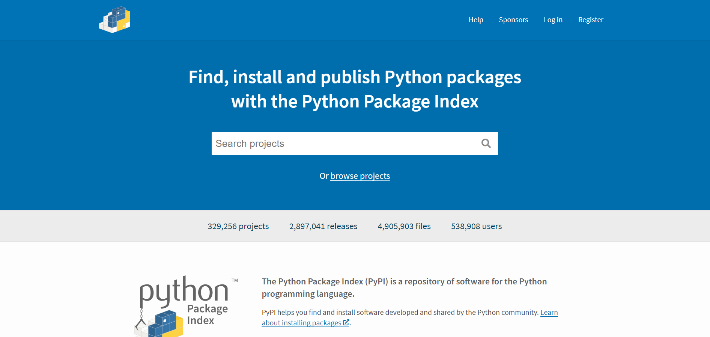
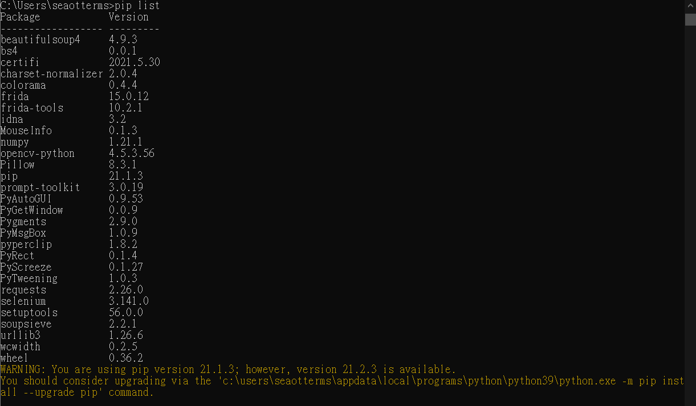

# Day 12 : 套件是甚麼，可以吃嗎(

今天終於脫離了比較痛苦(?)的python基礎語法教學，開始進入python中不可或缺的一環-套件。

套件是甚麼呢，套件其實就是一些工程師寫了一些該程式語言的功能，並把它公開出來任人下載，這樣在開發上就會比較方便，不用所有東西都自己寫。

# pypi

這是一個Python套件的網站，若想查詢套件可以來這裡查詢-https://pypi.org/

要使用python套件首先一定要知道的是pip指令，pip是一個以Python電腦程式語言寫成的軟體包管理系統，他可以安裝和管理軟體包。簡單來說，利用pip就可以下載python的套件，通常python安裝後就會順便安裝pip。可以在cmd輸入pip來確定有沒有安裝pip。

接下來就稍微講解如何使用pip指令吧

# pip list

在終端機輸入pip list可以查看目前電腦安裝的所有套件

# pip install

如果今天我需要使用一個套件，就要先將它下載到電腦上，我們可以使用pip install這個指令，例如我今天可能想要bs4這個套件(爬蟲套件)，我就可以在cmd輸入pip install bs4來下載安裝這個套件。

# pip install -v

在install後面加上 -v可以指定下載的套件版本，例如:pip install -v bs4==4.9.0

# pip uninstall

若今天想刪除一個套件，可以利用pip uninstall，用法格式跟pip install一樣

# py -m pip --version

查看pip版本用的指令

# py -m pip install -U pip

更新pip到最新版本的指令

講完基本的pip指令後，來看看在程式中怎麼使用吧

# import

要使用pip下載下來的套件，第一步就是要在程式碼最前面打上import 套件名稱，例如:

import bs4。

# from

套件就像是資料夾，有些功能可能放在其他資料夾。若要從這個資料夾中取出底層特定的資料夾，可以使用from 套件名稱 import 特定功能(資料夾)

例如: from bs4 import BeautifulSoup

以上就是套件的基本認識，有了這些基礎知識，終於可以開始使用套件了，明天會開始講基本的管理套件。