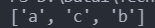

# Day 13 : 基礎套件的介紹-random，利用程式幫你做亂數選擇

今天來介紹一下ramdom這個套件:

random這個套件用來亂數選取，像是抽籤機等等的小程式都需要用到。

要使用套件記得先import此套件:

```python
import random
```

random有幾個常用的亂數產生方式，下面是幾個它可以使用的函式:

- random.random() : 產生0到1的隨機浮點數。
- random.randint() : 產生特定範圍的整數(int)，參數可以放範圍。例如random.randint(1,100) 就是從1到100中隨機產出一個整數數字。
- random.uniform() : 產生特定範圍的浮點數(float)，參數用法跟上述一樣，可以放整數或浮點數。
- random.randrange() : 產生特定範圍的整數(int)，跟randint的差別在它需要設定步數，像是這樣:

```python
import random
print(random.randrange(1,11,3))
```

這樣就會從1、4、7、10中隨機抽選。

- random.choice() : 從指定串列中抽出元素，像是這樣:

```python
import random
print(random.choice(['早安', '午安', '晚安']))
```

若是字串形式，將會獨立字元抽選:

```python
import random
print(random.choice("abcdefg"))
```

這樣會隨機抽出abcdefg中的其中一個字。

- random.choices() : 從指定串列中抽出複數元素，像是這樣:

```python
import random
a =['早安', '午安', '晚安']
print(random.choices(a,k=2))
```

比較常用的參數有k(指定取出的數量)以及weights(指定取出的機率):

```python
import random
a =['早安', '午安', '晚安']
print(random.choices(a,weights=[80,10,10]))
```

- random.sample() : 從指定字串中取出特定數量的值，並以串列形式回傳，sample以及choice的差別差在sample資料不可重複，chocie可以。

```python
*import* random
print(random.sample('abcdef',3))
```

- random.shuffle() : 打亂元素順序:

```python
import random
x=["a","b","c"]
random.shuffle(x)
print(x)
```



明天來把時間的套件講一講好了。