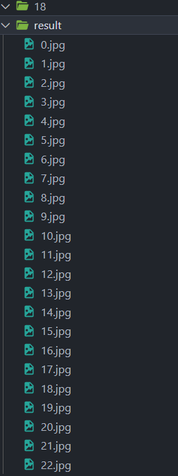

# Day 15 : 基礎套件的介紹-os套件，幫助你管理資料(下)

今天繼續來討論OS

若想要得到當前路徑，可以使用os.getcwd()。

```python
import os
path = os.getcwd()
print(path)
```


更改檔案名稱我們可以使用os.rename()，若我們要更改昨天的a.txt的檔名，可以這樣寫。

```python
import os
os.rename('test/a.txt','test/123.txt')
```


現在我不需要這個b.txt的檔案了，可以用os.remove()來把它移除。

```python
import os
os.remove('test/b.txt')
```


記住，刪除資料夾不能用os.remove()，這邊我們需要用os.rmdir( )。

```python
import os
os.rmdir('test')
```

不過要是空目錄才能刪除，有點麻煩就是了


講了一堆os的功能，直接來時做還是最快的。有一天我在整理檔案的時候，發現了一個問題，如下


前面有一堆數字，看起來很醜，所以我決定從1開始將他們重新命名。

當然不可能一個一個改，都學了python那當然就是用python解決，所以我寫出了下面的程式碼:

```python
import os

a=os.listdir('18')

g=len(a)

for i in range(0, g):
   os.rename(f'./18/{a[i]}',f'./result/{i}.jpg')
```

首先將路徑(18)這個資料夾的所有檔案名稱存入變數a，然後利用g變數讀取這個串列有多少筆資料(檔案名稱)，再來就是for迴圈出場的時候了!

我定義一個範圍， 從0到g，然後利用rename的方式，批量修改檔名，這邊利用了f字串，將每一個讀到的檔案名，更改成後面的{i}.jpg，注意我的路徑，我建了一個資料夾result，把改完名的檔案都丟到那。i會隨迴圈變動，結果會如下:



是不是比起一個一個改還要方便許多呢。

os基本介紹就講到這，明天應該會開始介紹靜態爬蟲。