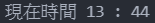

# Day 16 : 基礎套件的介紹-time，讓你擁有時間

今天就來介紹時間系列的套件庫吧。

## time

- time.time() :  顯示從1970/1/1 00:00:00 到當前的秒數，通常會拿來當時間戳記使用。
- time.sleep() : 可以讓程式停止指定秒數，在各種領域都會用到。像在爬蟲中就會為了避免太頻繁對伺服器發送要求而讓每一次的發送請求都加入time.sleep()，避免被伺服器偵測。單位是秒。
- time.localtime() : 獲得當前的本地時間，沒設定秒數就會使用當前時間，像是以下例子:

```python
import time
print(time.localtime())
```


可以分別取出各參數，像是這樣:

```python
import time
a = time.localtime()
print("現在時間",a.tm_hour,":",a.tm_sec)
```



- time.gmtime() : 這個跟上述例子一樣，只是他不是回傳你的本地時間而是回傳世界協調時間(UTC)
- time.asctime() : 這個蠻方便的，他可以將time.localtime()取出的時間轉成字串形式的時間，方便閱讀:

```python
import time
a = time.localtime()
print(time.asctime(a))
```


- time.strftime() : 這個就更實用了，他可以根據需求使用指定形式來顯示想要的時間輸出格式，可以參考下述例子:

```python
import time
a = time.localtime()
print(time.strftime("%Y/%m/%d %H:%M:%S", a))
```


常用參數可以從這邊找:https://docs.python.org/3/library/time.html#time.strftime

利用這些功能就可以讓你的python程式擁有時間，並且可以藉由時間來達到一些判斷等。