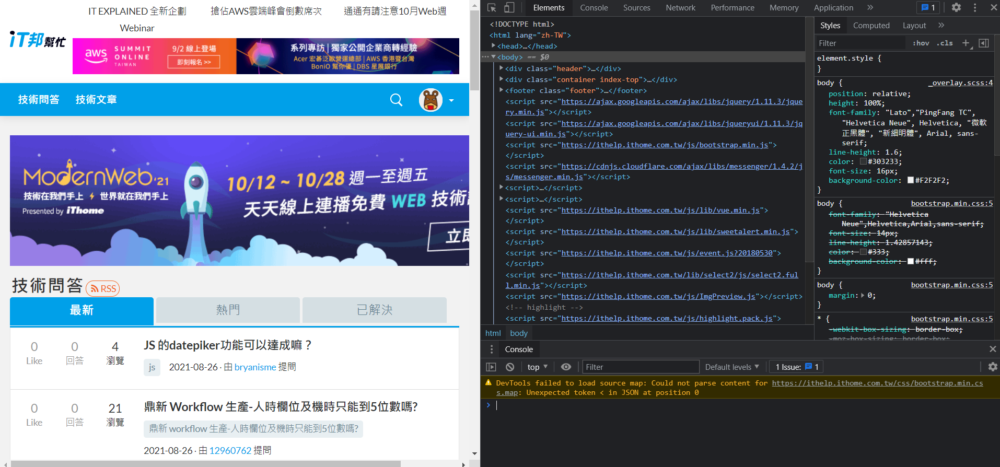

# Day 17 : 爬蟲基本介紹

在python非常有名的一個功能就是爬蟲。再來會開始介紹爬蟲到底是甚麼以及我們要怎麼使用它獲取我們想要的資料。

# 爬蟲到底是甚麼

爬蟲英文叫做web crawler，也可以叫spider。其實就是**模擬人類去做瀏覽網站的動作**。當你在網站上看到一些文章、資料時，你想拿下來做一些資料分析或是其他運用時，就需要用到爬蟲。

舉個簡單的例子，若我現在想要不用連上IT邦網站就能利用程式讀取每日新的文章，我們就可以利用爬蟲來實作每日爬一次文章資料的功能，再利用linebot或是discordbot來做到每日定期更新並傳給使用者等功能。

# 靜態爬蟲and動態爬蟲

爬蟲又分靜態以及動態，簡單來講就是有沒有加載網頁的概念。像是大部分論壇網站，HTML就寫在那邊，所以就可以利用靜態爬蟲的作法直接獲取資源，但像是googlemap等利用javascript生成網頁內容的網站，靜態爬蟲是無法獲取資源的，這時候就要使用動態爬蟲。利用webdriver直接模擬使用者開啟網頁的動作，進而達到加載網頁生成資源的效果。又或者像是論壇等需要登入或輸入資料、點擊按鈕等，都可以利用動態爬蟲配合webdriver來做到。

# 網頁三巨頭

剛剛提到了HTML、Javascript，為了後面的爬蟲我們簡單來提一下，網站的建構方式。

首先是HTML，HTML在網頁中就是屬於骨骼的部分，它將網站的架構建設出來，像是下方就是一個基本的HTML檔案:

```html
<!DOCTYPE html>
<html lang="en">
<head>
    <meta charset="UTF-8">
    <meta http-equiv="X-UA-Compatible" content="IE=edge">
    <meta name="viewport" content="width=device-width, initial-scale=1.0">
    <title>Document</title>
</head>
<body>
    HI
</body>
</html>
```

再來是CSS，這個東西像是衣服或外觀，可以修改HTML的資料的排版、樣式等，常見的CSS會長這樣:

```css
.test{
    color: blue;
}
.test2{
    color: red;
    font-size: 12px;
}
```

再來就是靜態爬蟲的噩夢-javascript。這種程式語言幫助網頁作互動，就像是一般的程式語言一樣，有函式、變數等，加上專門用來跟網站本體交互的語法讓javascript一直都在網站建設中成為非常重要的一環。以下是在網頁上呈現時間顯示的JS程式碼範例:

```jsx
window.onload =  ShowTime();
function ShowTime(){
  var NowDate=new Date();
　var h=NowDate.getHours();
　var m=NowDate.getMinutes();
　var s=NowDate.getSeconds();　
　document.getElementById('showbox').innerHTML = h+'時'+m+'分'+s+'秒';
　setTimeout('ShowTime()',1000);
  }
```

知道這些要幹嘛呢，其實重點在HTML上，要爬蟲前，要先知道我們要爬的東西在哪裏，進而撰寫程式碼，我們可以在瀏覽器中按下F12或是右鍵檢查，我們就可以看到建構網頁的HYML以及其他元素。



明天就來正式進入爬蟲吧，會先從靜態爬蟲開始，研究如何獲取自己想要的資源。