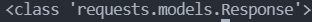
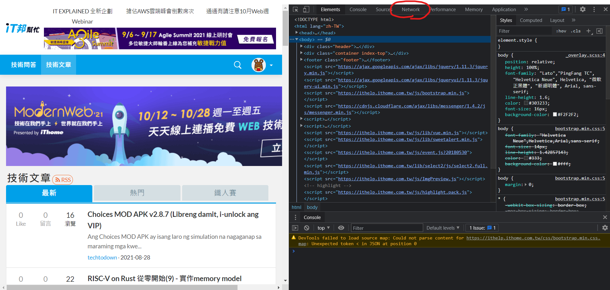
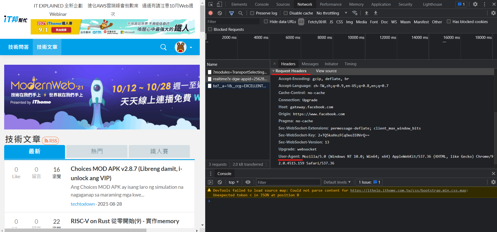
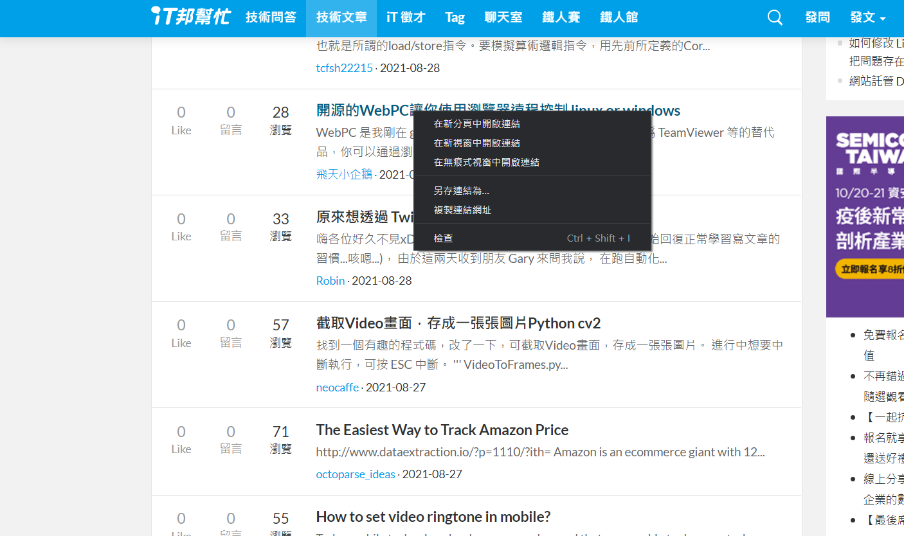
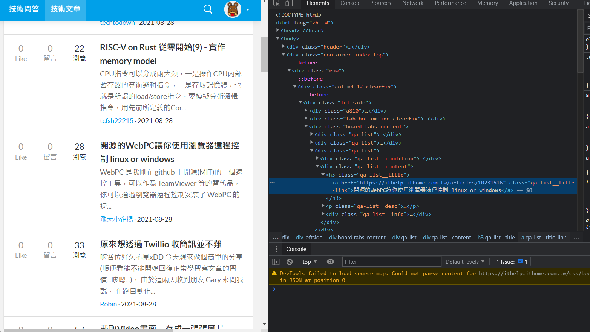
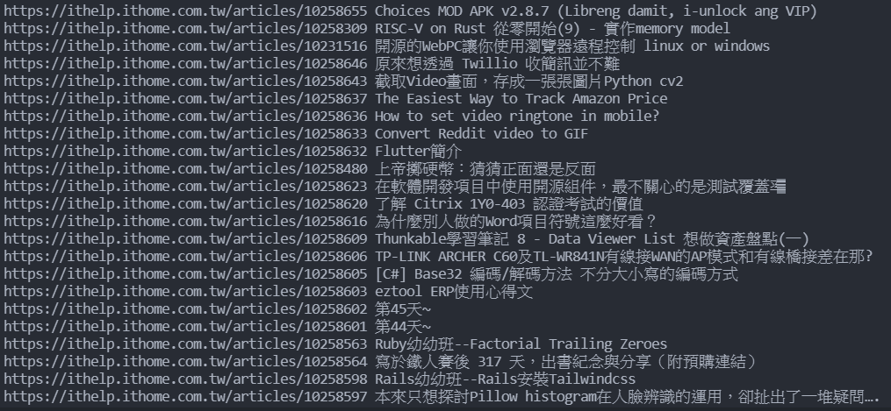

# Day 18 : 靜態爬蟲

今天就來講講最基本的靜態爬蟲吧，這裡要裝的套件是bs4(BeautifulSoup4)，它是用來做靜態爬蟲的一個專用的庫，利用pip install來安裝bs4套件

```bash
pip install bs4
```

並且將它引入

```python
from bs4 import Berautifulsoup
```

再來我們需要用來對HTTP做出請求的庫，叫做requests，也是一樣利用pip install來安裝套件

```bash
pip install requests
```

```python
import requests
```

爬蟲的部分我直接找個範例來做中學，假設今天我們需要IT邦當下的文章標題，以這個為題目撰寫一 隻爬蟲程式。

其實程式碼非常的簡單，大致分成三個部分，分為HTTP請求、資料爬取及處理以及迴圈爬取。

# HTTP請求

我們首先要先用request來對指定的URL(網址)送出請求，有點像是使用者連進網站時會對網站送出請求，網站同意後你才能連進去一樣，我們在程式碼新增下面的程式:

```python
response = requests.get("https://ithelp.ithome.com.tw/articles?tab=tech")
```

代表我們使用了requests.get這個方法來對後面的網址送出請求，並且將這個事情存到response這個變數中。

這時候如果使用type會發現這個變數的型態叫做這樣:



有些網站會專門擋自動化程式或機器人，所以通常在爬蟲時都會先偽裝成使用者，這時候就需要用到headers這個功能，那這個東西內要放甚麼呢，我們需要放入User-Agent(使用者代理)，讓網站認為你是真人，這個東西的取的方法很簡單，還記得在網站中按下F12可以取得網頁原始碼嗎，同樣的，也可以取得User-Agent，先按下F12，應該會看到這個畫面(以Chrome做示範):



左上角Network點下去


右邊往下滑找到Request Headers，下面的User Agent就會顯示你目前瀏覽器的資料了，直接複製，打入程式碼中:



```python
response = requests.get(
    "https://ithelp.ithome.com.tw/articles?tab=tech",
    headers={
        "User-Agent": "Mozilla/5.0 (Windows NT 10.0; Win64; x64) AppleWebKit/537.36 (KHTML, like Gecko) Chrome/92.0.4515.107 Safari/537.36"
    })
```

記得網址跟headers中間要有逗號，並且headers是用大括號包住，到這裡，HTTP請求部分就好了。

# 資料爬取

再來重要的就是，要取得網站上的甚麼資料。這時候就要出動BeautifulSoup了，首先，我們要先利用html.parseer(HTML解析器)來解析網站，再來因為我們要取得的是文章標題，所以形式是text。程式碼如下:

```python
soup = BeautifulSoup(response.text, "html.parser")
```

將剛剛的網站內容(已經存到變數response中)用形式為text(文字)的方式用html.parseer解析，並且存到變數soup中。

前置作業都準備好了，再來就是重要的取得內容，我們先在網站上右鍵文章內容，點取檢查:





會發現這串文字就在h3 class="qa-list__title"中的a標籤內。找了其他的文章名稱也是在一樣的組合中，所以我們可以使用迴圈的方式爬取全部資料，先使用select函式來篩選指定位置的資料:

```python
data = soup.select("h3.qa-list__title a")
```

將剛剛解析完的html(存到soup變數內了)利用select函式來篩選資料，這邊因為是 h3 class="qa-list__title中的a標籤，所以格式就是"h3.qa-list__title a"，篩選完後存到data，準備進行迴圈爬取。

# 迴圈爬取

其實這部分非常的簡單，寫這樣就好了:

```python
for d in data:
    print(d["href"], d.text)
```

寫一個for迴圈，範圍是data，並且定義一個變數(這邊用d)，然後每次要做的事情就是在剛剛篩選的地方中，print href裡面的東西以及這個a標籤中的text(文字)，href裡面的東西就是網址，所以執行後結果會長這樣:



這樣是是很方便做資料處理呢!

完整程式碼:

```python
import requests
from bs4 import BeautifulSoup

response = requests.get(
    "https://ithelp.ithome.com.tw/articles?tab=tech",
    headers={
        "User-Agent": "Mozilla/5.0 (Windows NT 10.0; Win64; x64) AppleWebKit/537.36 (KHTML, like Gecko) Chrome/92.0.4515.107 Safari/537.36"
    })

soup = BeautifulSoup(response.text, "html.parser")
data = soup.select("h3.qa-list__title a")

for d in data:
    print(d["href"], d.text)
```

明天會繼續找其他例子來進一步說明爬蟲的功能，今天就先到這吧。