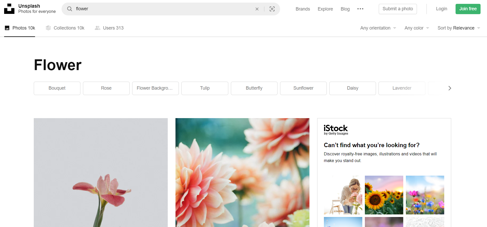
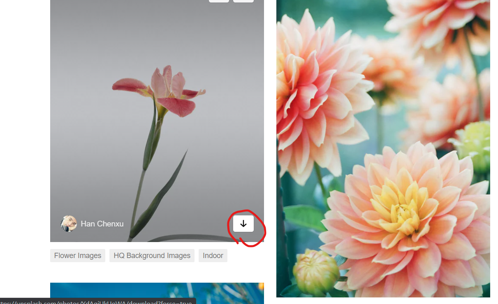
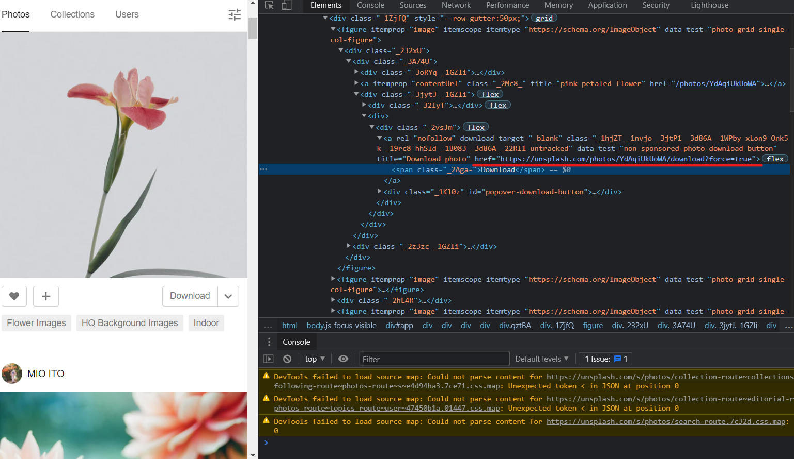
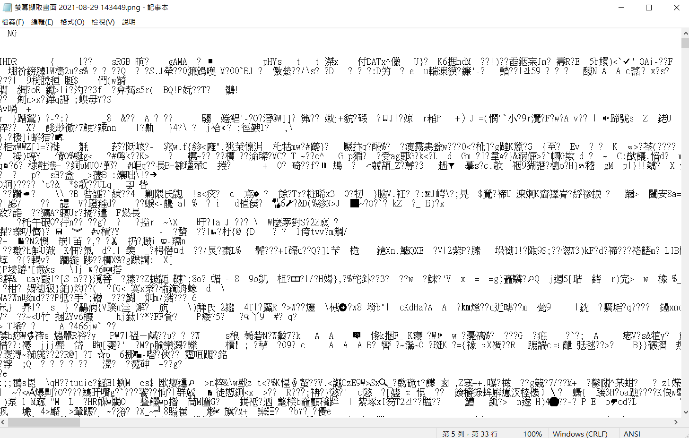
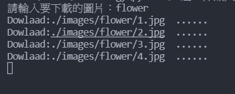
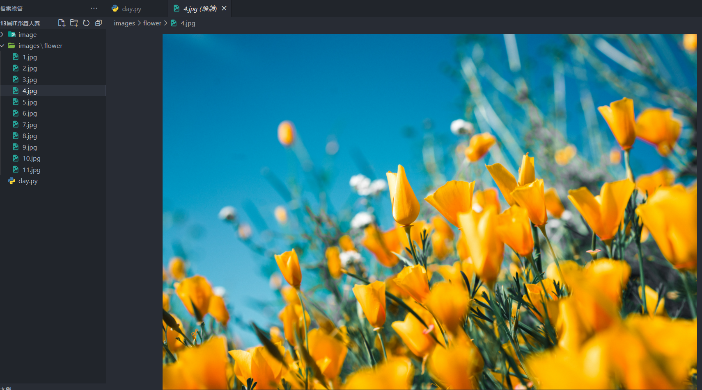

# Day 19 : 靜態爬蟲(下)

今天繼續來談論靜態爬蟲，昨天都在講解文字，今天來講講圖片的部分。常常看到一個網頁中有很多漂亮的圖片，可是一張一張下載太浪費時間了，這時候就可以使用爬蟲來批量下載圖片。

這次就用這個unsplash這個網站來作範例吧，這個網站有很多高畫質的圖，今天的目的就是寫一個可以在本地端搜索想要的圖並下載的功能。

## 網站分析

要進行搜尋的功能，問題最大的就是網址，所以要先找到網站的網址規律，才能根據想要的圖片更改URL發送HTTP請求。我們先在這網站中隨便搜尋一下:




其實就可以發現在網址中photos後又增加了"/搜尋的關鍵字"，找到規律後就可以開始撰寫程式了。

這次因為是真正的要取得圖片檔案，所以必須使用os套件來幫助自動化建立資料夾等功能，所以我們會用到三個套件:

```python
from bs4 import BeautifulSoup
import requests
import os
```

再來撰寫利用使用者的輸入來更改URL發送HTTP請求的功能，程式碼如下:

```python
input_image = input("請輸入要下載的圖片：")

response = requests.get(f"https://unsplash.com/s/photos/{input_image}")
```

ㄟ你怎麼沒打User Agent? 我懶(X)

還是建議各位打一下就是了，這邊的程式碼會在啟動程式後顯示"請輸入要下載的圖片："並且可以讓你輸入文字，將輸入的文字存入input_image並且利用f字串來更動網址。

再來又需要檢查網頁了，有看到那個箭頭嗎，看來那個地方就是下載圖片的按鈕了，直接右鍵檢查:





在<div class="_2vsJm">中有個href，我直接連進這個網址，結果它自動就幫我下載這張照片了，看來這網址就是我們的目標了

```python
soup = BeautifulSoup(response.text, "html.parser")
data = soup.find_all('div', {'class', "_2vsJm"})
```

利用find_all函式來找出所有<div class="_2vsJm">標籤，等等會利用迴圈進一步縮小範圍

因為等等會有照片命名的問題，所以我先定義一個變數n，初值為0，然後開始寫迴圈:

```python
n = 0
for datal in data:
    n = n+1
    a = (datal.find('a')['href'])
            
    folder_path = f'./images/{input_image}/'
    img_name = folder_path +f"{n}.jpg"
    r = requests.get(a)
    os.makedirs(folder_path, exist_ok=True)
```

程式碼開始複雜起來了呢，可是仔細看就會發現一點都不難。這邊我讓每跑一次迴圈，n就+1，然後用find函式更進一步地把剛剛篩選的範圍縮小到a的href存到a變數中，這邊把它print出來就可以看到剛剛下載用的網址了，再來我建立了images資料夾，並且將輸入的關鍵字作為這資料夾的下一層資料夾，把這路徑存到folder_path變數中，打算將下載的圖片放到這裡面。

再來就是變數命名的部分啦，要注意的一點是，在os中最好使用絕對路徑，比較不會有錯誤的產生，所以我將剛剛的folder_path(路徑)放進來，後面才接檔案名稱，用f字串的方式將剛剛的n放進來，後面再補副檔名jpg，這樣在每執行一次迴圈(每抓一張圖片)，檔案名稱就會按照順序從1往上變動，避免掉檔案名稱重複覆蓋的問題。

然後再用請求的方式得到網址a的資料並存到r變數中，再用os的makedirs函式創建剛剛的路徑資料夾。

有資料夾，有路徑，有資料，再來就是下載存檔了，這邊程式碼很短，只需要三行或兩行:

```python
with open(img_name, 'wb') as f:
        f.write(r.content)
        print('Dowlaad:' + img_name + '  ......')
```

利用open函式創建剛剛定義的檔案名稱，用wb模式寫入(w=write，b=bytes，為寫及二進制模式)

用content方式將剛剛抓到的東西全部寫到創建的檔案中，最後一行只是告訴我們進度而已，應該滿好理解的。

這邊說一下下載圖片的原理，其實那個網址就是一個存放在網路世界的資料，不知道各位有沒有用文字編輯器看過圖片檔案，應該會長這樣:



這種檔案就是一個一個位元組起來的，通常一般人是無法閱讀的。為甚麼要講這個呢，我們可以單純以一般常試想，如果這堆亂碼可以組合成一張圖片，那我只要取得這些資料就好了啊，爬蟲就是拿來達成這樣的功能。

上面的f.write(r.content)其實就如同剛剛講的，將網路上的這個檔案中的，像是上面這些構成圖片的資料，拷貝下來存到你開的檔案中。所以就某些層面來說，它可以說是下載圖片也不是下載圖片。這再次說明了電腦中的所有一切，都是一段一段的文字而已，並且這些文字也只是從0跟1轉換過來的而已。

再來就給各位看一下成果圖吧:





這樣就能方便下載圖片，再也不用手動按了，是不是很方便呢!

完整程式碼:

```python
from bs4 import BeautifulSoup
import requests
import os

input_image = input("請輸入要下載的圖片：")

response = requests.get(f"https://unsplash.com/s/photos/{input_image}")
soup = BeautifulSoup(response.text, "html.parser")

data = soup.find_all('div', {'class', "_2vsJm"})

n = 0
for datal in data:
    n = n+1
    a = (datal.find('a')['href'])
            
    folder_path = f'./images/{input_image}/'
    img_name = folder_path +f"{n}.jpg"
    r = requests.get(a)
    os.makedirs(folder_path, exist_ok=True)
    with open(img_name, 'wb') as f:

        f.write(r.content)
        print('Dowlaad:' + img_name + '  ......')
```

明天會稍微提及一下動態爬蟲，來講解如何使用webdriver。