# Day 20 : 動態爬蟲-利用webdriver達到自動登入

動態爬蟲的做法主要是用在動態網頁以及一些需要登入的網頁，藉由自動加載指定網頁，就可以獲得需要加載才能取得的資料。所以今天會來講講利用Webdriver自動化加載網頁的方法來取得資源，既然要講加載網頁，那就直接講登入好了，先從最基本的工具-Webdriver開始講起。

## Webdriver

WebDriver操作瀏覽器的一個介面，使用程式可以自動化操控WebDriver來進行登入帳號、自動輸入或是捲動頁面等，來達成靜態爬蟲無法做到的功能，簡單來講它就是個可以被程式控制的瀏覽器。

所以我們的目標就是寫個程式控制WebDriver來開啟指定網頁，就能自動加載網頁來取得我們要的資源。

要下載Webdriver很簡單，我們可以先到各個瀏覽器的Webdriver網站上下載相對應的版本(版本記得要選跟自己瀏覽器相同的版本)，像我是使用Chrome，我就可以到這個網站下載https://chromedriver.chromium.org/

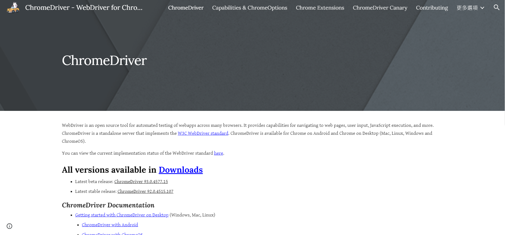

點擊Downloads就可以進入選擇版本的頁面

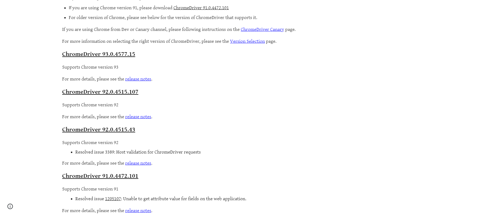

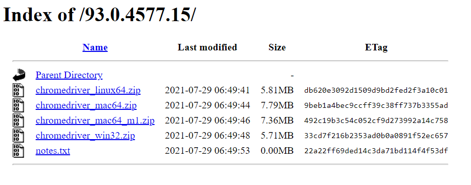

點擊相對應版本就能進到這個下載頁面，根據自己的作業系統下載解壓縮就好了。

## Selenium

Selenium是Python針對動態爬蟲的一個套件，可以藉由控制webdriver來達成爬蟲的目的，我們可以先藉由pip指令安裝這個套件:

```bash
pip install Selenium
```

再來我們先來測試Webdriver吧，剛剛下載的zip檔解壓縮後應該會產生一個exe執行檔，我們將它放到與程式碼同一個資料夾下，並且輸入以下程式碼:

```python
from selenium import webdriver

driver = webdriver.Chrome("./goolemapSpider/chromedriver.exe")
driver.get('https://www.google.com.tw/?gws_rd=ssl')
```

webdriver.Chrome用來連結你的webdriver，後面要放路徑，然後用get方法去開啟指定的網址。

執行後就可以看到跳出了一個新的Chrome視窗，並且上方顯示" Chrome目前受到自動測試軟體控制。"，並且開啟了google頁面，這樣就代表你的Webdriver是正常運作的囉!

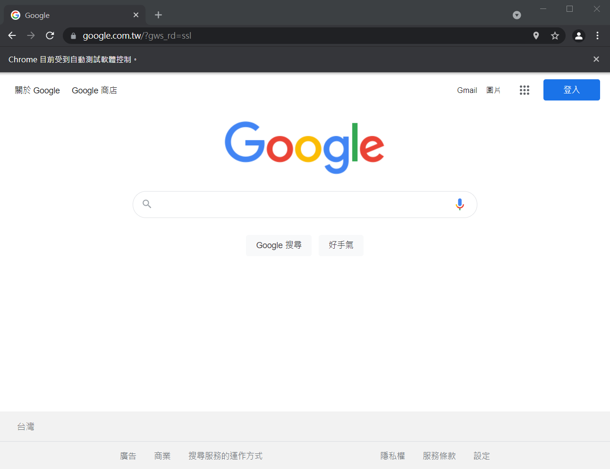

這次就來講解如何自動化登入twitter吧!只要能自動化登twitter，產生靜態網站，就能利用bs4爬取資料啦!

Twitter是需要帳號的，所以會用到Webdriver來自動輸入帳號登入進行爬取資料。


那這邊就從登入帳號開始吧!要使用爬蟲登入帳號，我們當然要知道帳號輸入的地方在哪，由於網站基本上都是用html以及css呈現給使用者的，所以Selenium提供了下列幾種方法，分別使用不同的方法取得html標籤位置:

- find_element_by_id : 利用id來選擇
- find_element_by_name : 利用name來選擇
- find_element_by_xpath : 利用xpath(節點位置)來選擇
- find_element_by_link_text : 利用文字來選擇
- find_element_by_partial_link_text : 利用部分文字來選擇
- find_element_by_tag_name :利用標籤元素來選擇
- find_element_by_class_name : 利用class來選擇
- find_element_by_css_selector : 利用css來選擇

可以在Twitter登入畫面輸入帳號的地方以及輸入密碼的地方按下右鍵檢查來看輸入帳號的地方的html原碼:

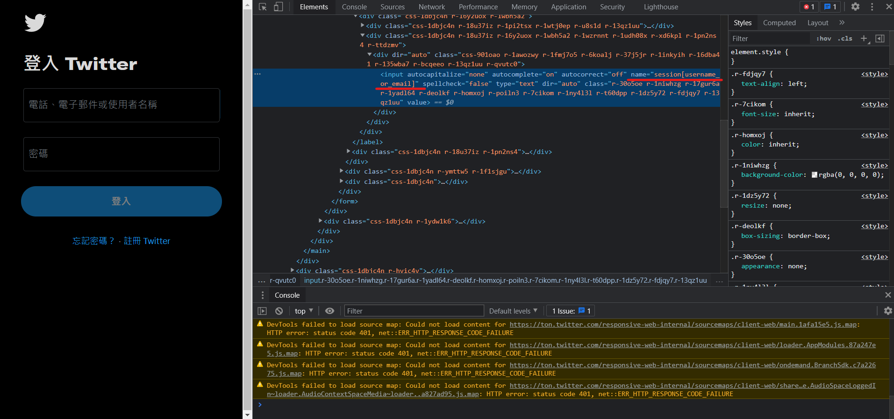

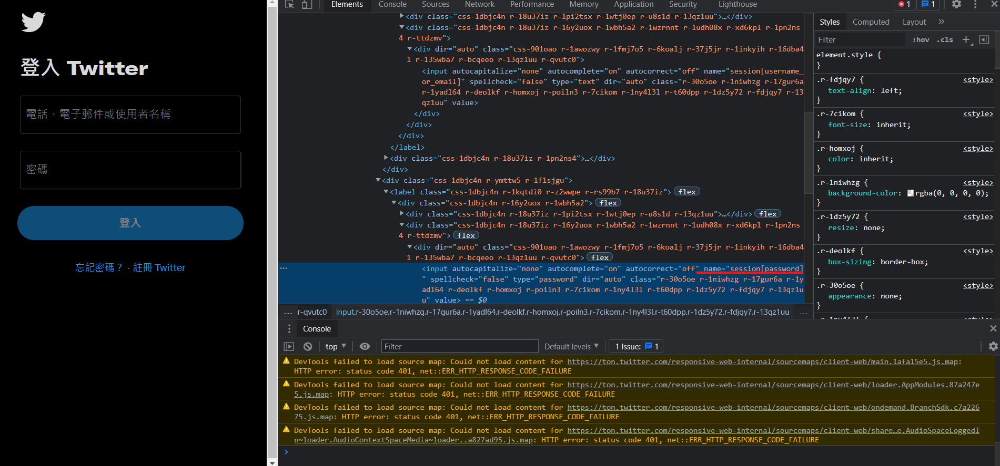

這邊用find_element_by_tag_name來選擇位置(因為字比較少(X)):

```python
from selenium import webdriver
import time

driver = webdriver.Chrome("./goolemapSpider/chromedriver.exe")
driver.get('https://twitter.com/login')

time.sleep(2)

email = driver.find_element_by_name('session[username_or_email]')
password = driver.find_element_by_name('session[password]')
email.send_keys('aaaa@gmail.com')
password.send_keys('aaaa')
```

先把啟動網址連結到twitter登入頁面，然後分別讀取輸入帳號以及密碼的位置，並給予到一個變數中(email、password)，再來會用到**send_keys**這個功能，它可以將指定的文字輸入到這個位置中，所以我們將自己的twitter帳號跟密碼打進去，執行程式碼:

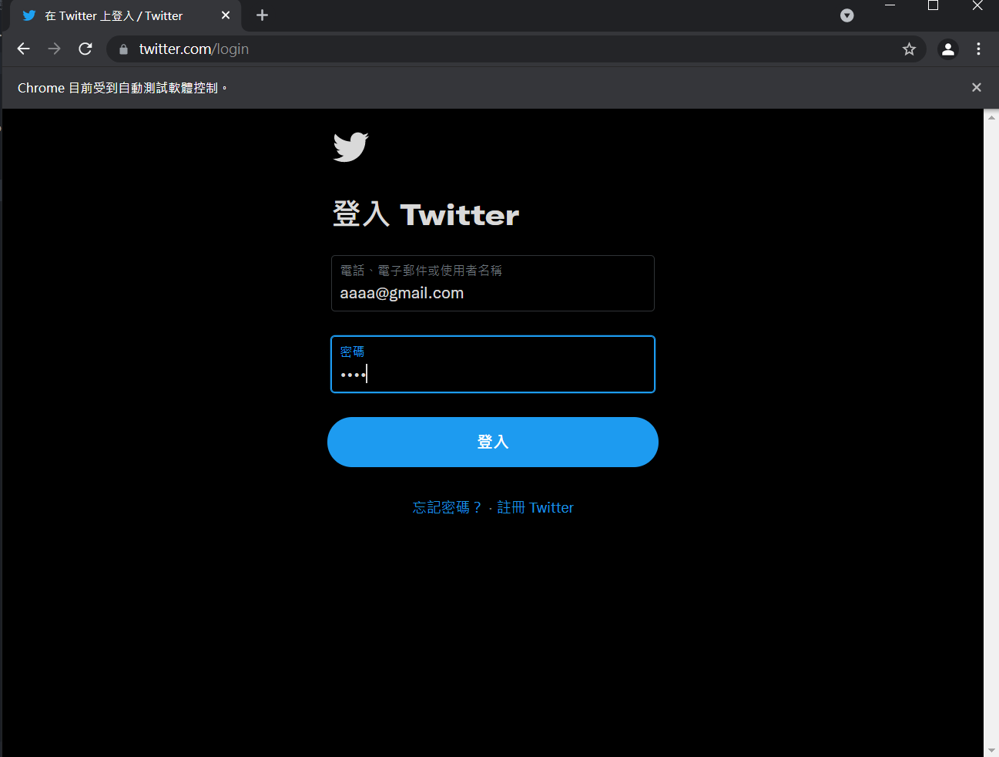

至於增加time.sleep的原因是實際在運作時可能會因為網速或是其他外在因素干擾而導致程式執行過快出問題，所以我會適當的利用time.sleep功能來增加延遲時間。

就會看到程式自動將我們的帳號密碼輸入進去了!接下來就是點擊登入按鈕，這時候會用到**click()**，顧名思義就是點擊，找到登入按鈕的html原碼:

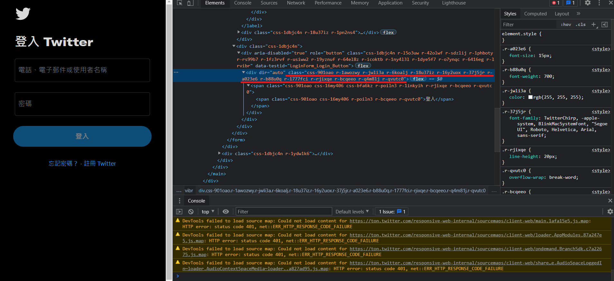

發現沒有name標籤，那我們就使用class標籤。這邊有個小細節就是**空格**，在實際撰寫程式碼時，空格沒有辦法被正常判斷，解決辦法為將空格的位置全部改成點，如下:

```python
time.sleep(2)

button = driver.find_element_by_class_name('css-901oao.r-1awozwy.r-jwli3a.r-6koalj.r-18u37iz.r-16y2uox.r-37j5jr.r-a023e6.r-b88u0q.r-1777fci.r-rjixqe.r-bcqeeo.r-q4m81j.r-qvutc0')
button.click()
```

再執行一次就會發現已經可以自動登入自己的twitter帳號了!

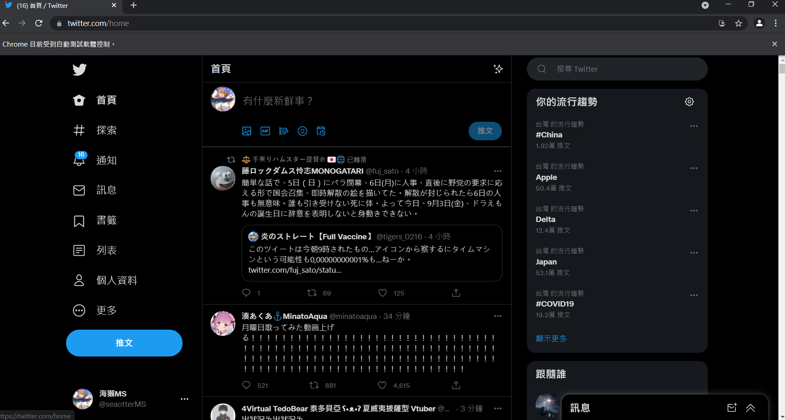

登入後當然就可以爬到各個想要的資料了，這次我想做的是利用twitter左上角的搜尋功能來搜尋不同的文章資料，所以再來就要針對左上角的輸入框，一樣檢查後會發現輸入框的html原碼，一樣使用class來取的位置，再來我以為按下搜尋鍵就好了，沒想到那個搜尋鍵根本不能按(((

這時候就要用到鍵盤輸入的功能了，只要能模擬鍵盤按下enter鍵就好了，在Selenium中，我們可以先將key這個函式引用進來，再使用send_keys()方法來模擬鍵盤輸入文字，如下:

```python
from selenium.webdriver.common.keys import Keys #這行加在最前面

search = driver.find_element_by_class_name('r-30o5oe.r-1niwhzg.r-17gur6a.r-1yadl64.r-deolkf.r-homxoj.r-poiln3.r-7cikom.r-1ny4l3l.r-xyw6el.r-641cr4.r-1dz5y72.r-fdjqy7.r-13qz1uu')
searchWord = input("請輸入關鍵字")
search.send_keys(searchWord)
search.send_keys(Keys.CONTROL,'\ue007')

time.sleep(4)
```

利用input來取得在終端機輸入的文字，並且輸入到搜尋功能的位置，並按下enter鍵(\ue007)，若想知道其他按鍵要輸入甚麼key值的話可以參考下面這個網站:

https://www.selenium.dev/selenium/docs/api/rb/Selenium/WebDriver/Keys.html

再執行一次程式，登入後會叫你輸入關鍵字

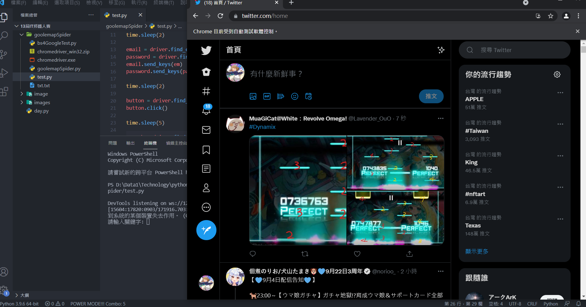

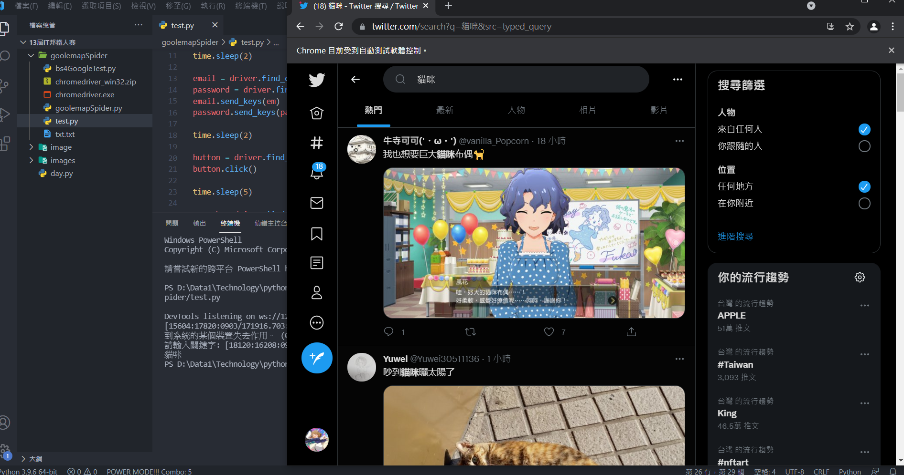

輸入文字後webdriver就會將我輸入的文字輸入到twitter的查詢功能。

其實這樣網頁還不算加載完成，因為在網頁沒有向下捲動時，其他的文章式不會加載進來的，所以我們需要讓webdriver做向下滾動的功能，這邊可以使用一個小迴圈:

```python
for x in range(1, 3):
    chrome.execute_script("window.scrollTo(0,document.body.scrollHeight)")
    time.sleep(3)
```

中間那行就是滾動頁面的函式用法，每滾動一次就休息3秒，這樣就可以加載多篇文章。

再來在網頁加載完成後，就可以用爬蟲了!這邊當然可以用Selenium來爬蟲，只要這樣就好:

```python
content = driver.find_element_by_class_name('css-901oao.r-1fmj7o5.r-37j5jr.r-a023e6.r-16dba41.r-rjixqe.r-bcqeeo.r-bnwqim.r-qvutc0')
print(content.text)
```

這是每篇文章內容的標籤，只要用text就可以將它呈現出來，可是這樣的方法只能取得第一篇文章的資料，這邊會建議使用上一篇跟上上篇講的BS4，也就是說利用webdriver以及Selenium動態爬蟲技術產生靜態網站，再用靜態爬蟲爬取資料，會是比較好的做法。

至於BS4的部分我就不實作了，上一篇跟上上篇都有完整的範例可以參考。

爬蟲的套件講解就到這邊，再來應該會帶大家認識pillow套件，幫助做一些簡單的照片合成。