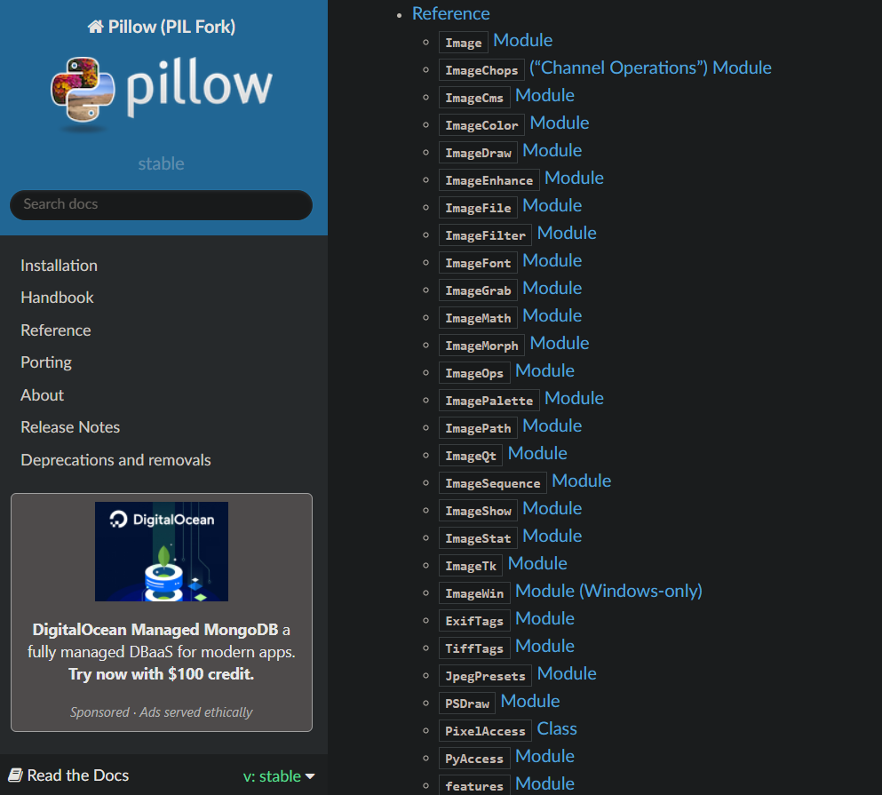
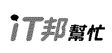
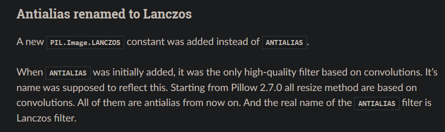
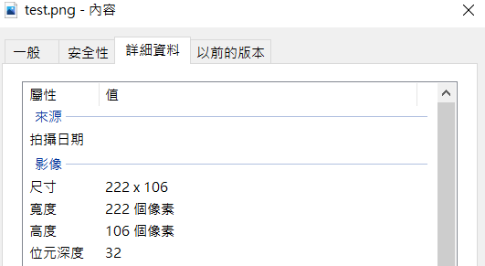
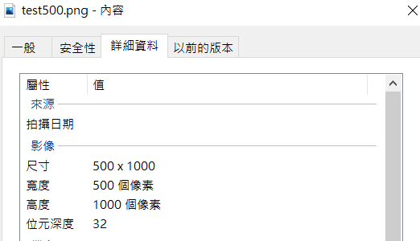

# Day 21 : pillow套件，處理照片

在python中，有許多可以拿來處理影像的套件。今天就先稍微介紹一下，pillow這個影像處理套件。

## Pillow(PIL)

Pillow是一個python中用來做影像辨識的套件庫，可以用來旋轉照片、嵌字、合成照片、變更圖片解析度等。網路上常常看到PIL，其實PIL是python2時期的產物，有點像是pillow的前身，到了python3，PIL才正式停止更新，之後便由Pillow接手PIL套件庫的東西並改強功能。這就是為甚麼在import時還是需要import PIL的原因。

## 安裝pillow

```bash
pip install Pillow
```

下圖從官網上找到的所有Pillow中的模組，可以根據想要的功能來使用，因為太多功能了我這邊就不一一贅述。



## 基本操作

```python
from PIL import Image

img = Image.open("test.jpg")
img.show()

newImg = img
newImg.save("test2.jpg")
```

在上圖的程式碼中，可以看到我利用Image.open()這個功能開啟了test.jpg這個圖片，用show()函式可以將照片顯示出來，並且我可以將這個圖片存到不同變數中，再用save()函式來做存檔。

- Image.open() : 開啟指定照片，後面括弧要放路徑
- show() : 顯示指定照片，前面要接變數名稱以及點號
- save() : 將處理完的照片存檔，前面要接變數名稱以及點號
- size() : 取得圖片長寬

再來就來介紹幾個常用的功能吧。

## 照片旋轉

在Pillow中，可以利用rotate()來調整相片角度

```python
from PIL import Image

img = Image.open("./test.png")
img.show()

newImg = img.rotate(90) 
newImg.show()
newImg.save("test90.png")
```

rotate()後面的參數放的是旋轉的角度，上述程式碼將原圖片旋轉90度後，再存成"test90.png"

執行前:


執行後:


可以看到，他可以將檔案直接旋轉，但**並不會改變長寬比例**。

## 轉檔

在使用save()功能時，可以在檔名後方加上format參數來指定檔案格式，可是通常檔名就已經定義了副檔名了，多打可以幫助Pillow更嚴謹的確定檔名

```python
from PIL import Image

img = Image.open("test.jpg")
img.show()

newImg = img
newImg.save("test2.jpg","jpg")
```

## convert()模式轉換

convert()這個函式用來轉變照片的模式，這邊就來講講幾個比較會用到的:

- 1 : 二值化模式，照片中的顏色不是黑就是白
- L : 黑白模式，有灰階的存在
- RGBA : 擁有透明度(Alpha)的全彩模式
- CMYK : 印刷全彩模式

官網中有更多不同的模式，如果好奇可以點[這裡](https://pillow.readthedocs.io/en/stable/handbook/concepts.html)進去看看。

這邊就拿二值化模式來測試好了，一樣用剛剛那張IT邦的截圖:

```python
from PIL import Image

img = Image.open("./test.png")
img.show()

newImg = img.convert('1')  
newImg.show()
newImg.save("test1.png")
```



看起來超詭異的(((

## 更改圖片尺寸(長寬)

更改尺寸一定會要用到resize()這個函式，這個函式需要輸入兩個參數，第一個參數是尺寸(長寬)，第二個是Filters的模式，若沒特別需要可以用預設就好。

[這邊](https://pillow.readthedocs.io/en/stable/handbook/concepts.html)有Filters的模式的詳細說明，不過老實說我也不是研究影像辨識的所以有看沒有懂(X

```python
from PIL import Image

img = Image.open("./test.png")
img.show()

newImg = img.resize((500,1000),Image.LANCZOS) 
newImg.show()
newImg.save("test500.png")
```

原本有看到一個Filters叫做ANTIALIAS，官網上好像沒提到，最後找了找資料才發現他是2.7.0版本的舊東西，現在已經更名為LANCZOS了。



這個Filters標榜高品質，所以我使用這個來做測試，這張圖片原本是222*106，我直接把它改成500*1000。



可以看到圖片很明顯的改變長寬了




## 嵌字

有些人可能會想在照片上加入一些文字，當然在Pillow中也可以輕而易舉地做到，而且可以使用自己想要的字體也能說是非常的方便。廢話不多說先上程式碼:

```python
from PIL import Image, ImageDraw, ImageFont

img  = Image.open("test.png")
draw = ImageDraw.Draw(img)

font  = ImageFont.truetype("kaiu.ttf", 20)
color  = "purple"
text = "這是測試"

draw.text((10, 10), text, fill=color, font=font)

img.save("test1.png")
```

先用ImageDraw.Draw()給打開的照片一個畫布讓它可以在上面做更改，之後用ImageFont.truetype()來選擇字體，這個函式要放三個參數，第一個是字型檔案，我事先有下載好kaiu.ttf(標楷體)這個字型，第二個是字型大小，第三個是解編碼格式，可有可無。我們也可以使用ImageFont.load_default()來使用預設字型，就不須設定字型了。

再來我將color定義為purple並存入color變數中，並先打好"這是測試"的文字後存入text變數中。

之後就要用到text()函式了，對剛剛的畫布使用text()函式，後面我放入了四個參數，分別是x,y座標、文字、fill(填入顏色)以及font(字體設定)，並將嵌入文字後的照片存檔為test1.png。


就可以輕鬆在圖片上填入文字囉!

## 影像合成

```python
from PIL import Image

imageA = Image.open('test.png')
imageB = Image.open('githubIcon.png')
imageB = imageB.convert("RGBA")
widthB , heightB = imageB.size

newimageB  = imageB.resize((int(widthB*0.2),int(heightB*0.2)),Image.LANCZOS)

resultPicture = Image.new('RGBA', imageA.size, (0, 0, 0, 0))

resultPicture.paste(imageA,(0,0))
resultPicture.paste(newimageB, (0,0), newimageB)

resultPicture.save("result.png")
```


合成兩張照片其實還滿簡單的。這個例子中我先將githubIcon這張照片等比例縮小，然後使用new()這個函式，建立起一個長寬為test這張圖(IT邦的圖)大小的背景底圖，最後的(0, 0, 0, 0)則是顏色，之後使用paste把圖片依序貼到這張底圖就好了，這邊有個細節要注意，我在貼上githubIcon這張照片時，我設定了第三個參數mask，這是為了讓它產生的圖片背景是透明的而設的，沒設mask會導致原本的底色顯示出來。


上圖就是沒設mask的結果，照片中心因為沒有設mask的原因導致將背景的IT邦字樣擋住了。

以上就是最基本的Pillow(PIL)套件功能，會了這幾個功能應該就能做非常簡單的圖片處理了，再加上其他套件的功能，就可以寫出超級陽春的P圖軟體了。明天會來開始介紹TKinter這款最基礎的pythonGUI套件，讓讀者可以開始進入圖像介面的領域。