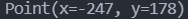
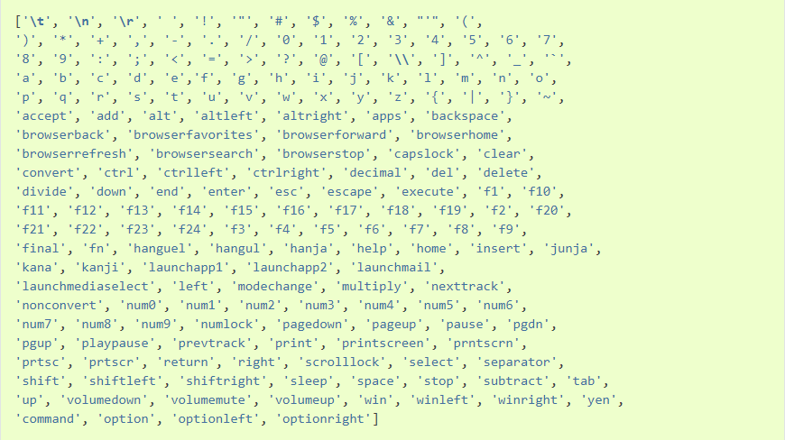
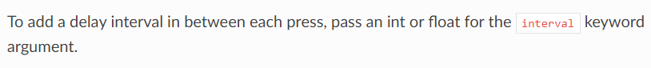
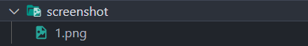

# Day 22 : PyAutoGUI，自動控制滑鼠跟鍵盤!

今天來講講PyAutoGUI這個套件好了，這個套件可以幫助你寫腳本，可以讓滑鼠以及鍵盤自動化，就不用人力慢慢按了。

第一步還是安裝以及導入套件啦

```bash
pip install pyautogui
```

```python
import pyautogui
```

- pyautogui.position() : 這個函式用來判斷滑鼠目前位置

```python
print(pyautogui.position())
```



為甚麼有負的，因為我是雙螢幕(

- pyautogui.size() : 判斷螢幕解析度，這應該沒什麼好講的。

## 滑鼠控制

- pyautogui.moveTo() : 這個函式可以用來移動滑鼠，除了設定移動到的位置以外，還可以設置移動的時間(duration參數):

```python
pyautogui.moveTo(100, 100, duration = 1.5) #用1.5秒移動到x=100，y=100的位置
```

- pyautogui.moveRel() : 跟上個函式功能一樣，只是這個函式是用你滑鼠目前的位置來做相對位置的判斷
- pyautogui.dragTo() : 這個函式用來模擬按著滑鼠拖曳的狀態，除了目標位置以及移動的時間外，還可以設定button參數選擇你要按的是左(left)、中(middle)、還是右(right)鍵

```python
pyautogui.dragTo(100, 100, duration=2, button='right') #用2秒按住滑鼠右鍵到x=100，y=100的位置
```

- pyautogui.click() : 顧名思義，在指定位置點擊，格式跟上一個函式一樣，少了duration參數，但多了兩個參數可以使用，分別是clicks(點擊次數)以及interval(點擊中相隔的時間)

```python
pyautogui.click(clicks=2, interval=0.5, button='right') #雙擊左鍵並且中途間隔0.5秒
```

- pyautogui.scroll() : 模擬滑鼠滾輪，參數放數字，代表滾動幾格

## 鍵盤控制

鍵盤有幾個常用的函式:

- pyautogui.press() : 按下特定按鍵，記得這邊的形態要用字串表示:

```python
pyautogui.press('enter') #按下enter鍵
pyautogui.press('c') #按下c鍵
pyautogui.press('alt') #按下alt鍵
```

從[這裡](https://pyautogui.readthedocs.io/en/latest/keyboard.html)可以看到其他按鍵對應的值



- pyautogui.keyDown() : 按住指定按鍵，到pyautogui.keyUp()時放開:

```python
pyautogui.keyDown('ctrl')
pyautogui.press('a')
pyautogui.keyUp('ctrl') #全選的功能鍵效果
```

可是每次弄這種組合鍵就要這樣打好多行，有沒有更快的方法?有，叫做hotkey():

- hotkey() : 顧名思義，熱鍵的函式。程式會按照先後順序按下按鍵:

```python
pyautogui.hotkey('ctrl', 'shift', 'esc') #開啟工作管理員的快捷鍵
```

看了一下官方文件發現，他其實也支援interval(點擊中相隔的時間)這個參數。



- pyautogui.screenshot() : 想不到吧，這套件也可以拿來螢幕截圖，蠻方便的。參數放的是路徑以及檔案名稱:

```python
pyautogui.screenshot('screenshot/1.png')
```



話說我都拿這個套件幹嘛?恩...除了某些遊戲需要定期的截圖或是刷道具遊戲需要定期點以外...

我都拿去按popcat(((((

其實上述我只有拿來玩過popcat而已(被打死

不過這套件的確是很方便就是了，利用上面這些函式就可以自由針對不同事件撰寫專門的自動化程式碼，就不需要人力慢慢點囉~