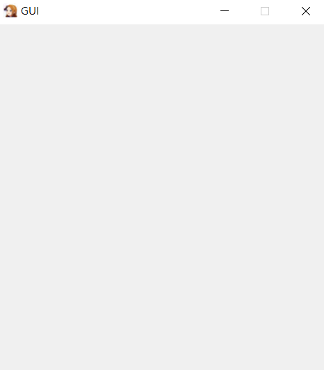
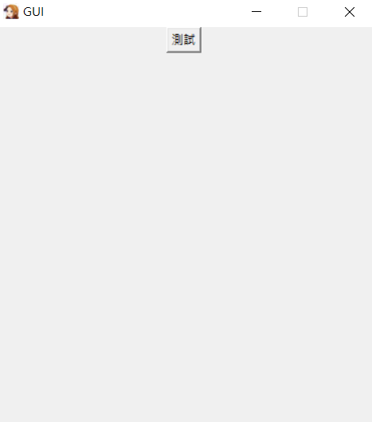
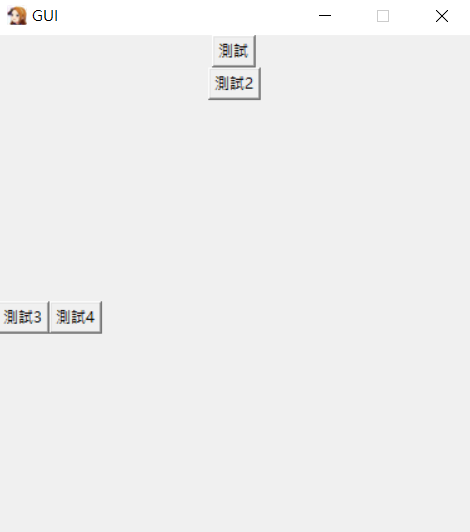
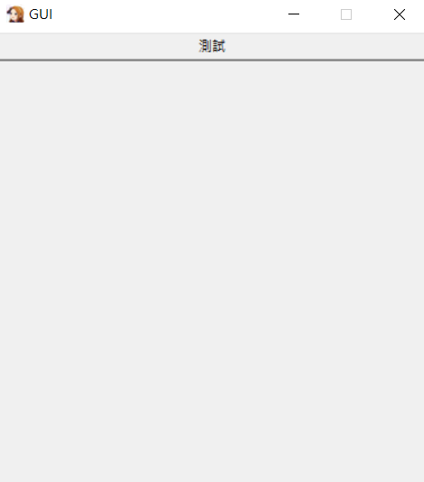
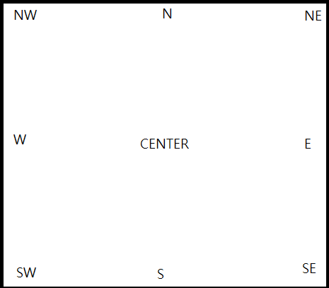
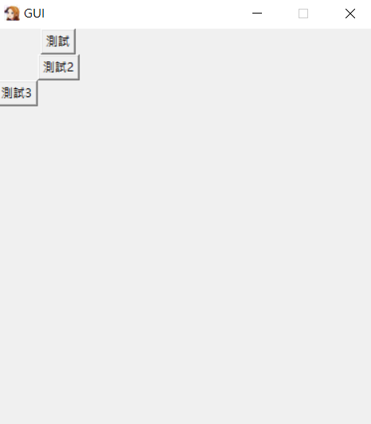
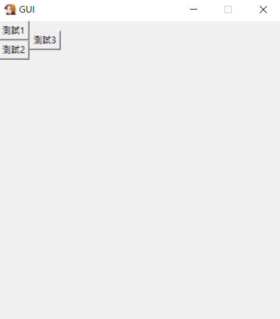
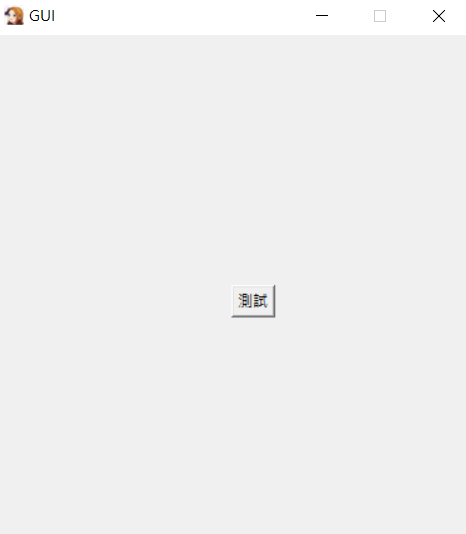
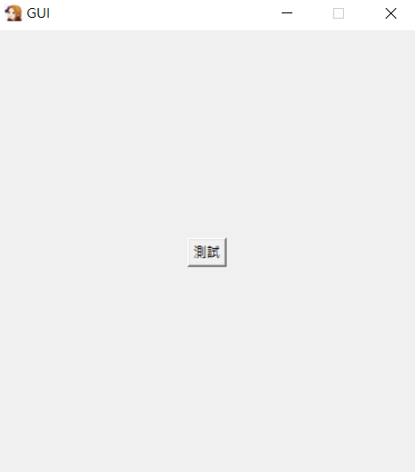

# Day 23 : Tkinter-利用Python建立GUI(基本操作及佈局篇)

在進入Tkinter之前，先來講講GUI到底是甚麼。

## GUI

GUI其實就是**圖形使用者介面(Graphical User Interface)**，也就是指採用圖形方式顯示的電腦操作使用者介面，簡而言之，就是我們經常見到的程式。因為早期的命令列介面(Command-Line Interface)，就是黑畫面，通常只支援滑鼠，並且需要記住繁雜的指令，對於一般使用者極其不友善，所以才會有GUI的出現

## Tkinter

Tkinter是可以將Python程式碼變成圖形化介面的套件庫，裡面給了很多一般圖形化介面的基本物件，像是按鈕(button)、視窗(frame)、文字標籤(label)、捲軸(scrollbar)等等...

Tkinter套件為內建，不需要使用pip安裝。

## 建立視窗

再來就開始建立第一個視窗吧:

```python
import tkinter as tk

window = tk.Tk()
window.title('GUI')
window.geometry('380x400')
window.resizable(False, False)
window.iconbitmap('icon.ico')
window.mainloop()
```

執行程式後可以看到跳出了一個視窗



最簡易的GUI就這樣做出來了，那來解析一下程式碼吧!

- tk.Tk() : GUI的核心，需要用這個函式建立架構
- title() : 程式上方的文字
- geometry()  : 長寬設定
- resizable() : 定義可不可以被使用者放大縮小視窗，我設定為兩個False代表長寬都無法被放大縮小
- iconbitmap() : 設定程式的圖示，可在括弧中放入檔案路徑
- mainloop() : 非常重要的函式，會使程式常駐執行，沒有這行的話因為程式執行完的關係所以你甚麼都不會看到，記得要打在程式的最後一行

空的GUI甚麼都沒有，我們來加一些東西好了。這篇會以佈局為重點，在進入下一篇元件篇時上手才會比較容易。

先來建立一個按鈕好了，按鈕叫做button，所以我們要從tk裡面取出這個物件，並且給他一個名字

```python
test = tk.Button(text="測試")
```

括弧中可以放很多不同的參數，最基本的就是text，會在按鈕上方顯示文字，當打完這行，執行後，你會發現，甚麼都沒有。因為沒有佈局，在tkinter中，每個元件都要做佈局，沒有佈局就不會顯示出來，所以再來我們要來談談佈局的部分。

## 佈局

在tkinter中，有三種佈局，分別是pack、grid以及place。

### pack:

pack為最基礎的佈局方式了，先來從side參數來講起。

- side : side主要有四種，top、buttom、right、left，分別是上下左右。

```python
test = tk.Button(text="測試")
test.pack(side="top")
```



它會利用相對位置來做佈局，那如果兩個元件同時用同一個參數呢?

```python
test = tk.Button(text="測試")
test.pack(side="top")
test2 = tk.Button(text="測試2")
test2.pack(side="top")
test3 = tk.Button(text="測試3")
test3.pack(side="left")
test4 = tk.Button(text="測試4")
test4.pack(side="left")
```



可以發現，如果是top或buttom，元件會直的向下或向上堆疊，right、left則是會橫的向右或向左堆疊。

- fill : fill這個參數用來調整元件填滿的屬性，有x、y、both可用

```python
test = tk.Button(text="測試")
test.pack(side="top",fill="x")
```



x的呈現效果長這樣，也可以從中知道y是直的填滿，both則是x軸以及y軸都填滿

- anchor : 用來設定元件起始位置(錨定位置)，有E,W,S,N,CENTER,NE,SE,SW,NW等



大致位置就像上圖，若未設定anchor，預設為CENTER。

anchor在tkinter中的constants，記得要使用時要先import進來。

```python
from tkinter.constants import * #加到第一行
```

### grid:

grid可以想像成是表格式的排列方法，可以利用控制row(列)以及column(行)來有規律地規劃元素。

```python
test = tk.Button(text="測試")
test.grid(row=0,column=1)
test2 = tk.Button(text="測試2")
test2.grid(row=1,column=1)
test3 = tk.Button(text="測試3")
test3.grid(row=2,column=0)
```



可以利用rowspan以及columnspan來合併儲存格，跟word的概念有點像:

```python
test = tk.Button(text="測試1")
test.grid(row=0,column=0)
test2 = tk.Button(text="測試2")
test2.grid(row=1,column=0)
test3 = tk.Button(text="測試3")
test3.grid(row=0,column=1,rowspan=2)
```



可以看到第二列被合併了，所以測試3的按鈕會長那樣。

### place:

place可以使用絕對位置來進行佈局，用法非常簡單，只要定義兩個座標(x,y)就能決定元件的位置。

```python
from tkinter.constants import CENTER #加到第一行

test = tk.Button(text="測試")
test.place(x=190,y=200,anchor=CENTER)
```

同時也可以加入anchor等參數，來讓版面更加的整齊，像上述的例子就是利用絕對位置加上anchor的補正，來實現置中的效果。





(上圖分別為有加anchor以及沒加的差別)

以上就是最基礎的tkinter佈局介紹，tkinter沒有甚麼太花俏的佈局，雖然在實用上比起Html有flex排版的功能，少了很多變化性，可是十分容易上手。明天會開始介紹元件的部分，讓大家可以藉由元件，以自己喜歡的佈局，配合python的功能做出一些實用性的小程式。