# Day 24 : Tkinter-利用Python建立GUI(元件篇)

今天會開始來講元件的部分~

## 通用參數

- height : 高度
- width : 寬度
- fg : 文字顏色
- bg : 背景顏色
- command : 指令，利用對應的函式讓物件動作時執行某些動作(無法在特定元件中使用)。例如以下例子:

```python
import tkinter as tk

def push():
    print("你點擊了按鈕")

window = tk.Tk()
window.title('GUI')
window.geometry('380x400')
window.resizable(False, False)
window.iconbitmap('icon.ico')

test = tk.Button(text="這是Button",command=push)
test.pack()
window.mainloop()
```

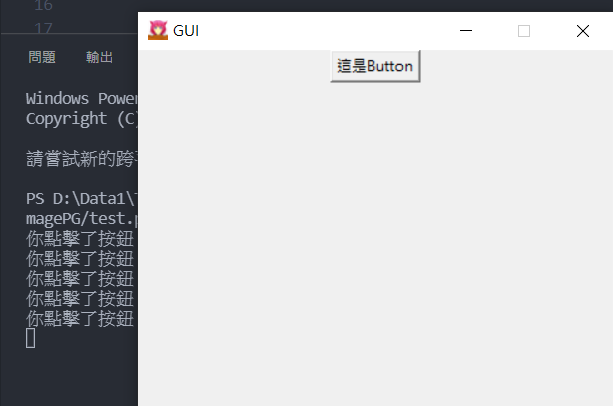

可以看到，點擊按鈕後會執行前面定義的函式push()，在cmd顯示"你點擊了按鈕"。

這些是比較基本的通用參數，基本上所有元件都可適用。

## button

button這個元件就是按鈕，比較重要的參數就是text，用來顯示按鈕內的文字。

```python
import tkinter as tk

window = tk.Tk()
window.title('GUI')
window.geometry('380x400')
window.resizable(False, False)
window.iconbitmap('icon.ico')

test = tk.Button(text="這是Button",bg="yellow")
test.place(x=0,y=0)
window.mainloop()
```

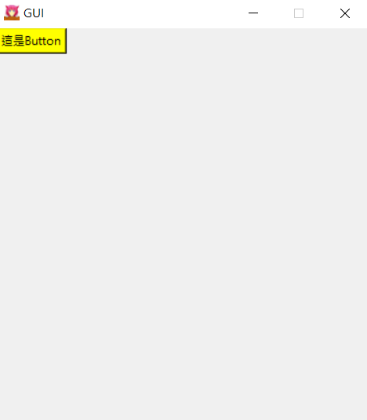

## Entry

Entry用來呈現讓使用者輸入文字的視窗，利用show()函式可以將輸入的文字轉成指定的文字，像是這樣:

```python
test = tk.Entry(show="*")
test.pack()
```

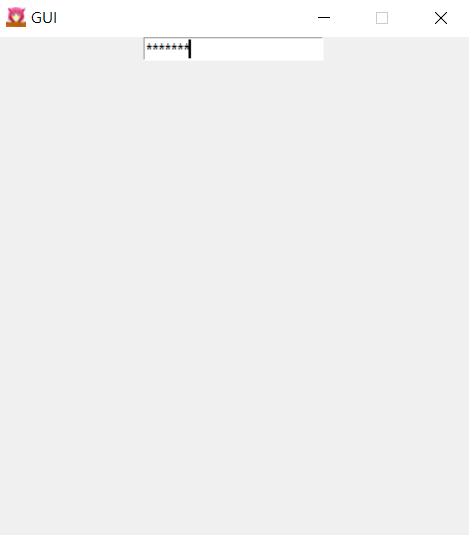

我們使用get()這個函式來取得使用者輸入的資訊，使程式可以根據使用者輸入的文字來做出不同的回應:

```python
import tkinter as tk

def show():
    password=test.get()
    print(password)

window = tk.Tk()
window.title('GUI')
window.geometry('380x400')
window.resizable(False, False)
window.iconbitmap('icon.ico')

test = tk.Entry(show="*")
test.pack()
testButton = tk.Button(text="show",command=show)
testButton.pack()
window.mainloop()
```

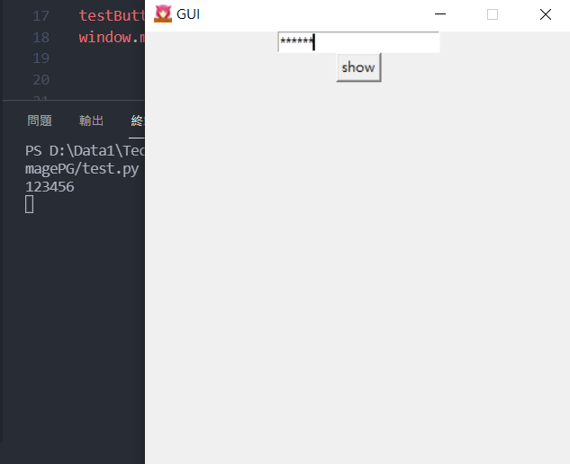

可以看到我將按鈕的command設定到了show()這個函式，並且用get()取得輸入框的文字並且顯示在cmd上。

## Checkbutton

這個元件在狀態上只有勾選以及未勾選的狀況，也就是1跟0，在狀態判別非常簡單。

常使用到的參數有下面這兩個:

- **state :** 勾選框的狀態，可以選擇normal(預設啟用)或是disabled(禁用)
- **text :** 顯示Checkbutton旁邊的文字

```python
test = tk.Checkbutton(text="這是啟用的勾選框",state="normal")
test.pack()
test2 = tk.Checkbutton(text="這是禁用的勾選框",state="disabled")
test2.pack()
```

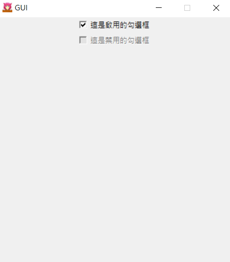

可以看到下面的勾選框無法點擊，上面的可以點擊，一樣可以使用get()來取得當前狀態(勾選為1，未勾選為0)，進而達到一些功能。

## Radiobutton

這個元件就是常見的按圓形按紐，通常不能複選。

若要一組Radiobutton，我們必須把它們編到一組，才會在點擊不同按鈕時切換選項。

```python
radioVar = tk.IntVar()
radio1 = tk.Radiobutton(text='Button1',variable=radioVar, value=1) 
radio2 = tk.Radiobutton(text='Button2',variable=radioVar, value=2) 
radio3 = tk.Radiobutton(text='Button3',variable=radioVar, value=3)

radio1.place(x=40,y=25)
radio2.place(x=140,y=25)
radio3.place(x=240,y=25)
```

用tk.IntVar()函式，並在不同Radiobutton中的參數variable中放入一樣的組別名稱，然後設定選取時的value為多少:

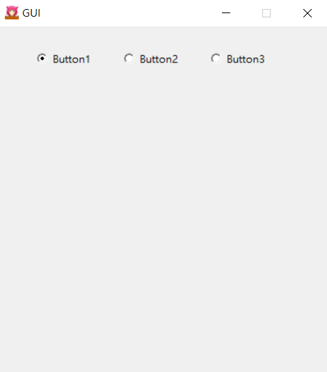

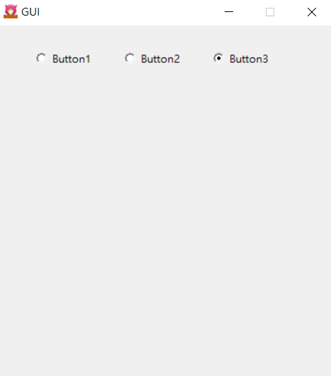

## Label

Label就是標籤(講廢話)，可以想像成是一個空的盒子，可以放入你想要的東西。通常我都使用image函式來塞圖片，先用tk.PhotoImage()這個功能選取圖片後，再丟到Label中:

```python
img =tk.PhotoImage(file='01.png')
test = tk.Label(image=img)
test.pack()
window.mainloop()
```

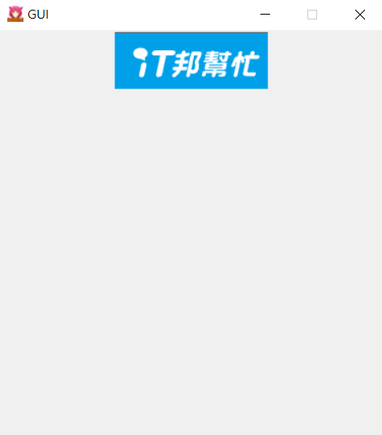

## Menu

這個就是我們常常在程式上方可以看到的開啟檔案阿，儲存等等的那一排。

```python
window = tk.Tk()
window.title('GUI')
window.geometry('380x400')
window.resizable(False, False)
window.iconbitmap('icon.ico')

menu = tk.Menu(window)
window.config(menu=menu)
menu.add_command(label='開啟')

window.mainloop()
```

用tk.Menu可以建立一層的menu，再利用add_command()來創建元素:

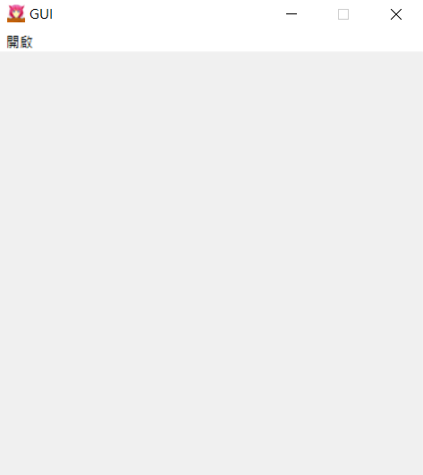

如果想要按下menu後可以跳出更多選項的話，我們需要建立第二層menu:

```python
menu = tk.Menu(window)
window.config(menu=menu)
menu2 = tk.Menu(menu)
menu2.add_command(label='開啟')
menu2.add_command(label='儲存')
menu2.add_command(label='另存')
menu.add_cascade(label='功能',menu=menu2)
```

先建立第一層menu，將menu2這個變數(第二層menu)綁在menu(第一層menu)下，並且建立三個menu2的元件，再用add_cascade()這個功能將第一層menu建立出來然後把menu2的東西綁進去。(好麻煩

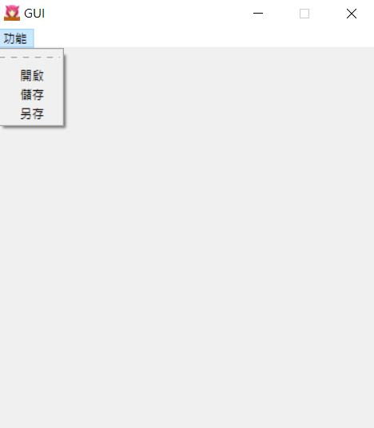

虛線可以將tearoff參數設置為0來讓它消失。

```python
menu2 = tk.Menu(menu,tearoff=0) #這行改成這樣
```

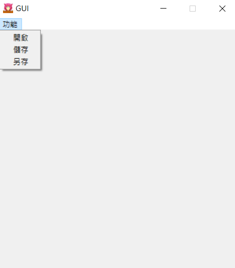

其實還有滿多元件的，想了解更多的可以來這個網站看:https://www.tutorialspoint.com/python/python_gui_programming.htm

明天直接來實際做一個有用(?)的小程式出來好了，實作才是進步的最大核心!