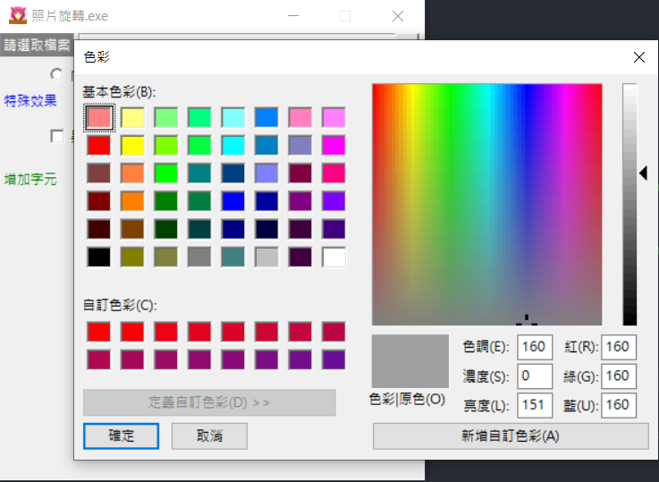

# Day 25 : Tkinter實戰，配合pillow製作簡易的處理照片程式(上)

今天會來配合pillow簡單製作一個旋轉圖片的GUI，並且會增加一些pillow的功能到這個GUI上，讓使用者可以用非常簡單的小程式處理照片。

先來我這次預計做的程式:


主要就是實作針對照片處理的一些功能，那廢話不多說直接將前面所學用上吧!

## 版面配置

先把版面配置做好吧，我們需要三個Button、三個Label、三個Radiobutton、兩個Checkbutton以及

兩個Entry。

這邊我使用place去做排版，畢竟這種小程式我會把螢幕大小鎖定，用place排版可以有更高的自訂性:

```python
win = tk.Tk()
win.title('照片旋轉.exe')
win.geometry('380x400')
win.resizable(False, False)
win.iconbitmap('icon.ico')
'''Label區域'''
lb = tk.Label(text="請選取檔案",bg ="grey",fg="white",height=1)
lb.place(x=0 ,y=0)
lb2 = tk.Label(text="特殊效果",fg="blue",height=1)
lb2.place(x=0 ,y=50)
lb3 = tk.Label(text="增加字元",fg="green",height=1)
lb3.place(x=0 ,y=120)
'''Label區域'''
'''Entry區域'''
loadFile_en = tk.Entry(width=40)
loadFile_en.place(x=70 ,y=0)
input_word = tk.Entry(width=40)
input_word.place(x=70 ,y=120)
'''Entry區域'''
'''Radiobutton區域'''
radioVar = tk.IntVar()
radio1 = tk.Radiobutton(text='向右90度',variable=radioVar, value=1) 
radio2 = tk.Radiobutton(text='向左90度',variable=radioVar, value=2) 
radio3 = tk.Radiobutton(text='180度旋轉',variable=radioVar, value=3)
radio1.place(x=40,y=25)
radio2.place(x=140,y=25)
radio3.place(x=240,y=25)
'''Radiobutton區域'''
'''checkbutton區域'''
color_checkbutton = tk.IntVar()
color_checkbutton1 = tk.Checkbutton(text='黑白化',variable=color_checkbutton)
color_checkbutton1.place(x=40,y=80)
Binarization_checkbutton = tk.IntVar() 
Binarization_checkbutton1 = tk.Checkbutton(text='二值化',variable=Binarization_checkbutton)
Binarization_checkbutton1.place(x=140,y=80)
'''checkbutton區域'''
'''Button區域'''
loadFile_btn = tk.Button(text="...",height=1)
loadFile_btn.place(x=355 ,y=0)
color_choice = tk.Button(text="顏色選擇")
color_choice.place(x=70,y=140)
output_btn = tk.Button(text="輸出",height=1)
output_btn.place(anchor=CENTER,x=180 ,y=200)
'''Button區域'''
win.mainloop()
```

ㄜ...超長，可是應該沒什麼困難的點，就是把元件排版全部打出來，再用一些參數微調而已而已。


畫面就這樣寫好了，可是此時還沒有任何功能，再來就慢慢的把功能加進去吧!

## 功能實作

先把選取檔案的部分做出來吧，我希望這個程式可以在選取檔案時，針對照片來選擇，其他附檔名不要顯示出來，我們來寫個函式，將點擊三個點的那個按鈕指向這個函式:

```python
from tkinter import filedialog
def loadFile():
    if loadFile_en.get() is None:
        file_path = filedialog.askopenfilename(filetypes = (("png files","*.png"),("all files","*.*")))
        loadFile_en.insert(0,file_path) 
    else:
        file_path = filedialog.askopenfilename(filetypes = (("png files","*.png"),("all files","*.*")))
        loadFile_en.delete(0,'end')
        loadFile_en.insert(0,file_path)
```

wait，一上來就這麼多東西，沒關係，我一行一行解釋。

第一行我們先把filedialog功能import進來，這個功能專門用來開啟檔案對話框。再來定義loadFile()這個函式:filedialog.askopenfilename()可以用來開啟檔案對話框並且選擇檔案。我們可以設定參數filetypes，顯示指定的副檔名。然後再把這串路徑用insert()的方式丟到旁邊的Entry中。這邊要注意的是若再次選擇檔案的話，要將舊檔案路徑的文字清除，所以我利用get()來判斷Entry是否為空，否的話就要使用delete()函式，從第一個字元清到end(結束)。

打好這部分後，就可以把三個點的button加入command = loadFile，讓按鍵按下後可以執行這個函式:

```python
loadFile_btn = tk.Button(text="...",height=1,command=loadFile) #這行多加command=loadFile
```


這樣就達到我們要的功能囉!

下一步來處理顏色選擇那個按鍵好了，那邊是用來選擇嵌入字樣的顏色，先來寫一個函式將顏色選擇器寫進來。這邊會用到tkinter.colorchooser中的cc功能，所以一樣先import進來:

```python
import tkinter.colorchooser as cc
def colorChoice():
    color=cc.askcolor()
    print(str(color))
color_choice = tk.Button(text="顏色選擇",command=colorChoice) #這行改成這樣
```

一樣將command指到我們新建立的colorChoice()函式。我先使用cc.askcolor()這個函式，這個函示可以叫出顏色選擇器選擇顏色。然後將這個函式的輸出用字串顯示出來。執行程式後應該會長這樣:



隨便選個顏色案確定，他就會把顏色的值輸出到cmd上:


不過選擇後...沒有任何地方告訴我們選擇了甚麼顏色ㄟ，所以為了讓程式人性化，我打算新增一個Label來放當前所選的顏色，在Label元件區新增一個元件:

```python
colorPrint = tk.Label(height=1,width=2) #新增到Label區域
colorPrint.place(x=130 ,y=143) #新增到Label區域
```

前置作業就做好了，再來就是傳入值了。想想剛剛顯示在cmd上面的東西，如果還記得的話，這就是我們之前講的tuple型態。tkinter的顏色參數可以使用HEX的形式，所以我們要做的事情就是將tuple的第二個值取出，並改變剛剛新定義的Label中的參數，要更動參數可以用config()這個函式，我這邊選擇改變它的bg(背景)參數。

```python
#改成這樣
def colorChoice():
    color=cc.askcolor()
    color = color[1] 
    colorPrint.config(bg=color)
#改成這樣
```

取出第二個值，使用config參數將剛剛新定義的Label的bg參數改成我們取出的值。基本上這樣就好了，來看一下成果ㄅ:


這樣使用者就可以知道自己選了甚麼顏色了!

明天就開始來撰寫照片處理的部分以及輸出吧，好久沒打這麼多字了...