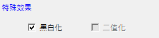
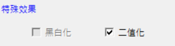
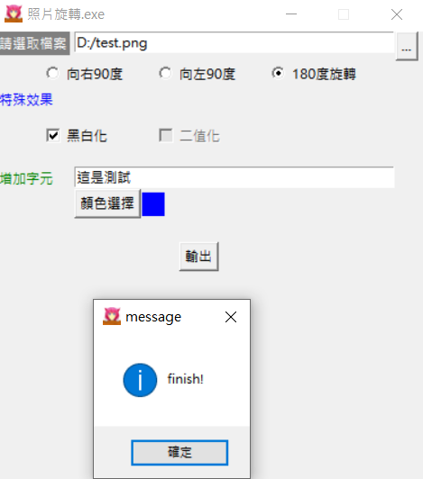

# Day 26 : Tkinter實戰，配合pillow製作簡易的處理照片程式(下)

今天繼續把上一篇文的程式做完，沒看過的記得要去看喔!

## 圖片轉向

那再來就先來做轉向的部分:

```python
from PIL import Image

def output():
  fileRoute = loadFile_en.get()
  imgOpen = Image.open(fileRoute)
  name = fileRoute.split('/')
  if radioVar.get()==0:
    new_imgOpen = imgOpen.rotate(0)
  if radioVar.get()==1:
    new_imgOpen = imgOpen.rotate(90)
    new_imgOpenResult = new_imgOpen
  if radioVar.get()==2:
    new_imgOpen = imgOpen.rotate(270)
    new_imgOpenResult = new_imgOpen
  if radioVar.get()==3:
    new_imgOpen = imgOpen.rotate(180)
    new_imgOpenResult = new_imgOpen
```

定義output這個函式，我打算把處理圖片的程式碼都寫在裡面。

還記得可以利用get()來獲得元素嗎。先用get()取得剛剛選取的照片路徑，然後用PIL的Image.open()開啟，定義name變數，將路徑用split切好，然後再設定當按鈕被點下時要讓照片如何選轉，然後旋轉完丟到new_imgOpenResult這個變數中，準備進行下一步:特殊效果。

## 特殊效果

再來進到特殊效果的部分，二值化跟黑白化不能並存，既然都用checkbutton了，那就只能想辦法寫成點選一個選項時另一個選項禁用了，所以我又寫了一個**checkbutton_state()**函式。

```python
def checkbutton_state():
  if color_checkbutton.get()==1:
    Binarization_checkbutton1.config(state='disabled')
  elif color_checkbutton.get()==0:
    Binarization_checkbutton1.config(state='normal')
  if Binarization_checkbutton.get()==1:
    color_checkbutton1.config(state='disabled')
  elif Binarization_checkbutton.get()==0:
    color_checkbutton1.config(state='normal')
```

判斷不同狀態進而設定兩個按鍵的state，記得要把兩個按鍵設置command參數並指到這個函式。





可以看到點選一個按鍵時另外一個按鍵就會變成disabled，無法點選的模式。

再來就來處理特殊效果的程式碼，其實也不難，就是將剛剛的new_imgOpenResult再做一層:

```python
if Binarization_checkbutton.get()==1:
    new_imgOpenResult = new_imgOpen
    new_imgOpenResult = new_imgOpenResult.convert('1')    
if color_checkbutton.get()==1:
    new_imgOpenResult = new_imgOpen
    new_imgOpenResult = new_imgOpenResult.convert('L')
```

if內的第一行是怕說如果沒有選擇反轉的話，要將變數名變成new_imgOpenResult方便接下來做特殊效果。

```python
if color_checkbutton.get()==1 or Binarization_checkbutton.get()==1 or radioVar.get() != 0:
    new_imgOpenResult.save(f"new_{name[-1]}")
```

我又寫了一個判別式，如果上述作完就想輸出的話，就可以從這邊先存檔，檔名我預設是"new_"加上剛剛用split切好的路徑的倒數第一個值(檔名)。

再來就是嵌入文字的部分了:

```python
if input_word.get() is not None:
    w ,h = imgOpen.width, imgOpen.height
    word = input_word.get()
    image_table = Image.new(mode='RGBA', size=(w,h))
    draw_table = ImageDraw.Draw(im=image_table)
    font = ImageFont.truetype('kaiu.ttf', 20)
    image_table.save("text.png")
    text = word
    color = colorPrint['bg']
    draw_table.text((0, 0), text, font = font, align ="left",fill = color)
    image_table.save("text.png")
```

先判斷是否有輸入文字，有在進入。可以看到文字的顏色是由上面第9行讀取顯示顏色的Label的背景參數，其他的就是設定文字的參數，之前都有提到過這邊就不多做解釋。

```python
		if Binarization_checkbutton.get()==1 or color_checkbutton.get()==1 or radioVar.get() != 0:
      imageA = Image.open(f"new_{name[-1]}")
    if radioVar.get() == 0 and Binarization_checkbutton.get()==0 and color_checkbutton.get()==0:
      imageA = imgOpen
    imageA = imageA.convert('RGBA')
    widthA , heightA = imageA.size
    imageB = Image.open('text.png')
    imageB = imageB.convert('RGBA')
    newWidthB = int(widthA)
    newHeightB = int(heightA)
    imageB_resize = imageB.resize((newWidthB, newHeightB))
    resultPicture = Image.new('RGBA', imageA.size, (0, 0, 0, 0))
    resultPicture.paste(imageA,(0,0))
    right_bottom = (0,0)
    resultPicture.paste(imageB_resize, right_bottom, imageB_resize)

    resultPicture.save(f"new_{name[-1]}")
```

注意縮排，這些都要包在"if input_word.get() is not None:"這裡面，前面兩個if是判斷說前面有沒有做剛剛的轉向或特殊效果，有就開啟剛剛存檔的照片，沒有就開啟原圖片。這邊我把文字的位置固定在左上角，有興趣的人也可以研究可以指定位置的方法。

之後儲存檔案，並在"def output():"層級下的最後面將name清空並且用tk.messagebox.showinfo()，寫一個彈出視窗告訴使用者已經處理完了，並且將這個函式附加到output_btn(輸出)按鈕上。

```python
name = ''
tk.messagebox.showinfo("message", "finish!")
```

```python
output_btn = tk.Button(text="輸出",height=1,command=output) #增加command參數
```

在來就來實際測試吧!

### 原圖:




### 處理過的:


這樣就完成了!老實說這種寫法雖然滿好理解的，可是程式碼繁雜，一堆的if也很不舒服，所以還是建議多訂幾個函是參數互傳，可以更好維護程式碼。這個程式當然還有很多可以思考的地方，例如改變文字大小、位置，增加其他功能阿等等的，就交給各位發揮想像力摟，下面附上完整程式碼(好長

```python
from tkinter.constants import CENTER
from tkinter.messagebox import *
import tkinter as tk
from tkinter import filedialog
import tkinter.colorchooser as cc
from PIL import Image,ImageDraw,ImageFont

#函式定義的部分
def loadFile():
    if loadFile_en.get() is None:
        file_path = filedialog.askopenfilename(filetypes = (("png files","*.png"),("all files","*.*")))
        loadFile_en.insert(0,file_path) 
    else:
        file_path = filedialog.askopenfilename(filetypes = (("png files","*.png"),("all files","*.*")))
        loadFile_en.delete(0,'end')
        loadFile_en.insert(0,file_path) 

def checkbutton_state():
  if color_checkbutton.get()==1:
    Binarization_checkbutton1.config(state='disabled')
  elif color_checkbutton.get()==0:
    Binarization_checkbutton1.config(state='normal')
  if Binarization_checkbutton.get()==1:
    color_checkbutton1.config(state='disabled')
  elif Binarization_checkbutton.get()==0:
    color_checkbutton1.config(state='normal')

def output():
  fileRoute = loadFile_en.get()
  imgOpen = Image.open(fileRoute)
  name = fileRoute.split('/')
  if radioVar.get()==0:
    new_imgOpen = imgOpen.rotate(0)
  if radioVar.get()==1:
    new_imgOpen = imgOpen.rotate(90)
    new_imgOpenResult = new_imgOpen
  if radioVar.get()==2:
    new_imgOpen = imgOpen.rotate(270)
    new_imgOpenResult = new_imgOpen
  if radioVar.get()==3:
    new_imgOpen = imgOpen.rotate(180)
    new_imgOpenResult = new_imgOpen

  if Binarization_checkbutton.get()==1:
    new_imgOpenResult = new_imgOpen
    new_imgOpenResult = new_imgOpenResult.convert('1')    
  if color_checkbutton.get()==1:
    new_imgOpenResult = new_imgOpen
    new_imgOpenResult = new_imgOpenResult.convert('L')

  if color_checkbutton.get()==1 or Binarization_checkbutton.get()==1 or radioVar.get() != 0:
    new_imgOpenResult.save(f"new_{name[-1]}")  

  if input_word.get() is not None:
    w ,h = imgOpen.width, imgOpen.height
    word = input_word.get()
    image_table = Image.new(mode='RGBA', size=(w,h))
    draw_table = ImageDraw.Draw(im=image_table)
    font = ImageFont.truetype('kaiu.ttf', 20)
    image_table.save("text.png")
    text = word
    color = colorPrint['bg']
    draw_table.text((0, 0), text, font = font, align ="left",fill = color)
    image_table.save("text.png")

    
    if Binarization_checkbutton.get()==1 or color_checkbutton.get()==1 or radioVar.get() != 0:
      imageA = Image.open(f"new_{name[-1]}")
    if radioVar.get() == 0 and Binarization_checkbutton.get()==0 and color_checkbutton.get()==0:
      imageA = imgOpen
    imageA = imageA.convert('RGBA')
    widthA , heightA = imageA.size
    imageB = Image.open('text.png')
    imageB = imageB.convert('RGBA')
    newWidthB = int(widthA)
    newHeightB = int(heightA)
    imageB_resize = imageB.resize((newWidthB, newHeightB))
    resultPicture = Image.new('RGBA', imageA.size, (0, 0, 0, 0))
    resultPicture.paste(imageA,(0,0))
    right_bottom = (0,0)
    resultPicture.paste(imageB_resize, right_bottom, imageB_resize)
    resultPicture.save(f"new_{name[-1]}")

  name = ''
  tk.messagebox.showinfo("message", "finish!")  

def colorChoice():
    color=cc.askcolor()
    color = color[1]
    print(str(color))
    colorPrint.config(bg=color)
#Tkinter的部分
win = tk.Tk()
win.title('照片旋轉.exe')
win.geometry('380x400')
win.resizable(False, False)
win.iconbitmap('icon.ico')
'''Label區域'''
lb = tk.Label(text="請選取檔案",bg ="grey",fg="white",height=1)
lb.place(x=0 ,y=0)
lb2 = tk.Label(text="特殊效果",fg="blue",height=1)
lb2.place(x=0 ,y=50)
lb3 = tk.Label(text="增加字元",fg="green",height=1)
lb3.place(x=0 ,y=120)
colorPrint = tk.Label(height=1,width=2)
colorPrint.place(x=130 ,y=143)
'''Label區域'''
'''Entry區域'''
loadFile_en = tk.Entry(width=40)
loadFile_en.place(x=70 ,y=0)
input_word = tk.Entry(width=40)
input_word.place(x=70 ,y=120)
'''Entry區域'''
'''Radiobutton區域'''
radioVar = tk.IntVar()
radio1 = tk.Radiobutton(text='向右90度',variable=radioVar, value=1) 
radio2 = tk.Radiobutton(text='向左90度',variable=radioVar, value=2) 
radio3 = tk.Radiobutton(text='180度旋轉',variable=radioVar, value=3)
radio1.place(x=40,y=25)
radio2.place(x=140,y=25)
radio3.place(x=240,y=25)
'''Radiobutton區域'''
'''checkbutton區域'''
color_checkbutton = tk.IntVar()
color_checkbutton1 = tk.Checkbutton(text='黑白化',variable=color_checkbutton,command=checkbutton_state)
color_checkbutton1.place(x=40,y=80)
Binarization_checkbutton = tk.IntVar() 
Binarization_checkbutton1 = tk.Checkbutton(text='二值化',variable=Binarization_checkbutton,command=checkbutton_state)
Binarization_checkbutton1.place(x=140,y=80)
'''checkbutton區域'''
'''Button區域'''
loadFile_btn = tk.Button(text="...",height=1,command=loadFile)
loadFile_btn.place(x=355 ,y=0)
color_choice = tk.Button(text="顏色選擇",command=colorChoice)
color_choice.place(x=70,y=140)
output_btn = tk.Button(text="輸出",height=1,command=output)
output_btn.place(anchor=CENTER,x=180 ,y=200)
'''Button區域'''
win.mainloop()
```

剩下最後一個系列了，再來把Linebot介紹完就能休息了，加油!