# Day 27 : 撰寫LineBot，利用短短三天認識自動化機器人(上)

今天來講LineBot吧。大家應該都用過Line這款交友軟體吧，這款軟體除了能方便聊天以外，他的機器人功能也可以做到許多事情。

## 取得自己的第一個Linebot

就先從開始辦Linebot開始吧，先來到[這個網頁](https://developers.line.biz/console/)，登入自己的Line帳號:

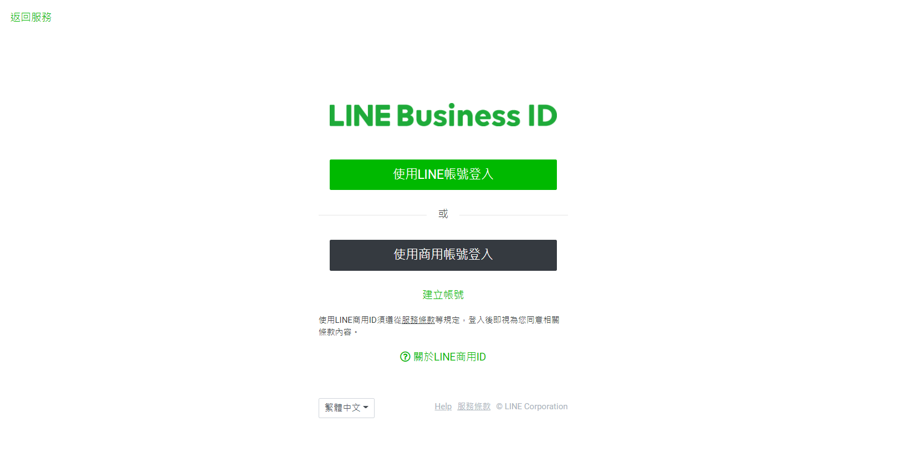

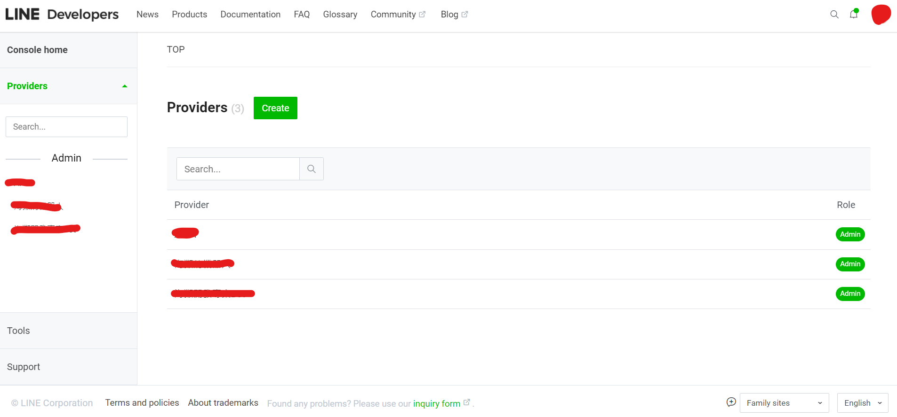

這邊可以點擊上方Create先建立Provider，建完後點進去就可以創建自己的機器人了。

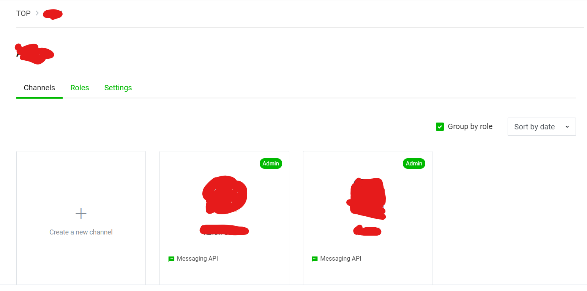

點擊Create a new channel

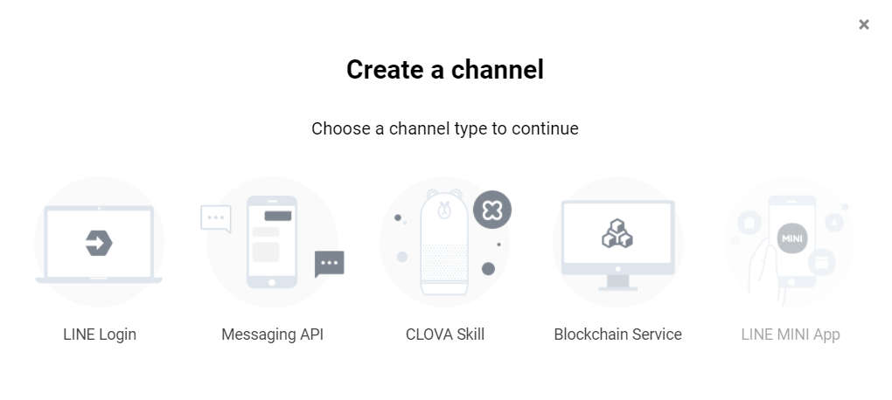

我們這次要撰寫的是Messaging API，這類型的Linebot主要是拿來做自動化回復訊息等用途的，比較泛用，點下去後按照設定設定機器人名字圖片等，這邊隨意設定即可。

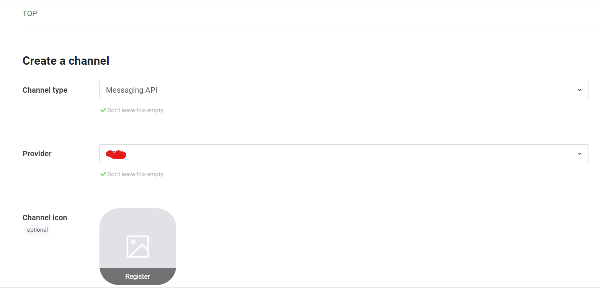

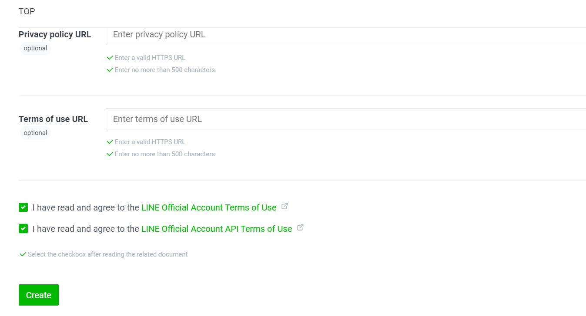

一些URL的設定暫時不用，好了就按下Create，這樣就建立完成囉!

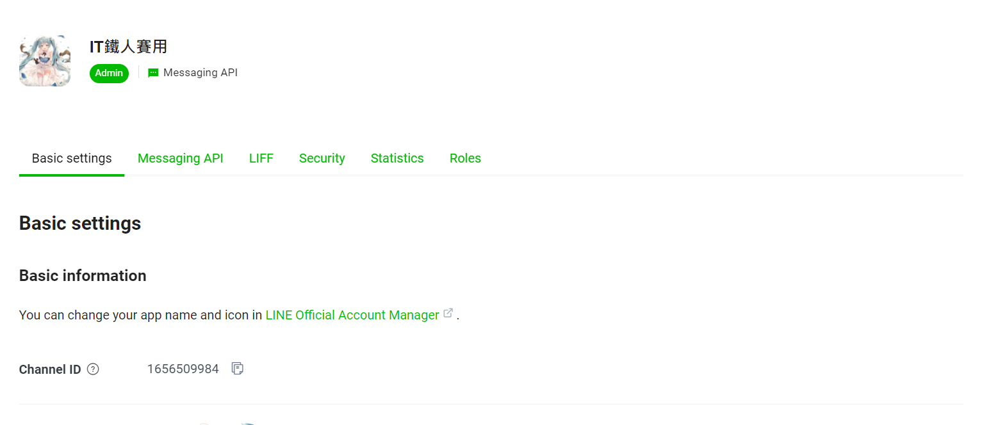

再來來說明Linebot的模式:

Linebot主要有兩種模式，一種是Auto response的模式，一種是webhook模式。我們可以去這裡查看目前哪個模式有啟用，在大部分狀況下，這兩種模式是可以共用的。

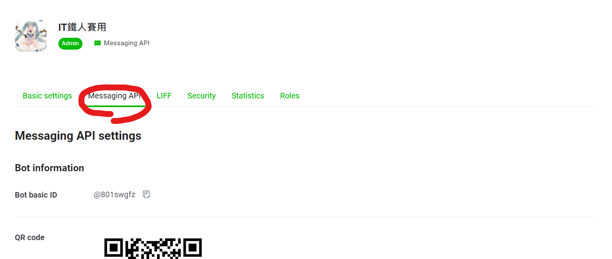

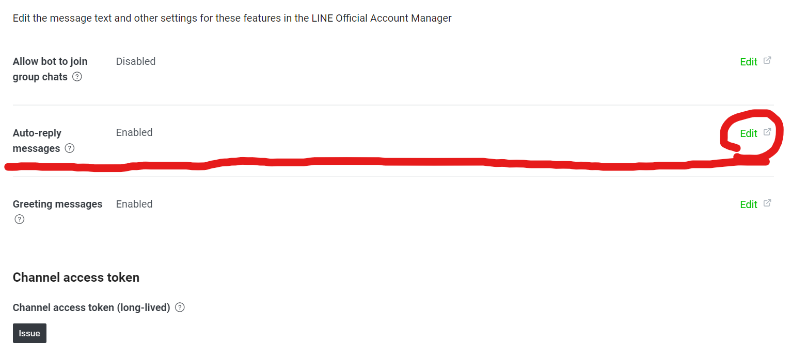

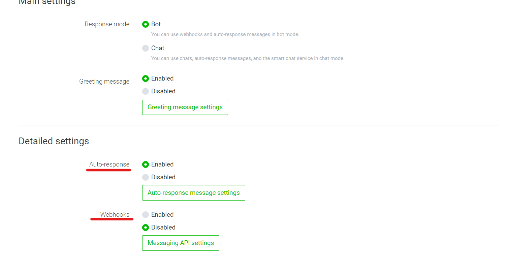

點擊上方Auto-response message settings，就可以進入Auto-response模式的設置

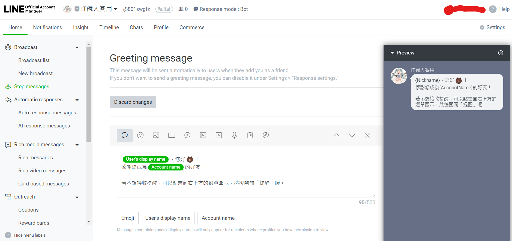

旁邊的Automastic responses可以用來設定使用者說了甚麼機器人要回應甚麼，可以選擇文字、貼圖、音檔、地理位置等，這個就給大家自己玩玩，因為這不是我們主要要的東西。這個模式用久了就會發現功能其實不多，雖然官方幫你都整理好了，可是耐玩性低。所以我們要介紹的是webhook模式，這個模式可以使用自己撰寫的程式碼讓機器人動作，有很多種作法，可以用ruby、JS等，我們當然要用python啦，在進入程式碼的部分之前我們先了解一下程式碼是如何跟機器人串接的。

### Auto-response模式:

我們對機器人講話，機器人回傳資料到Line伺服器做比對，看要做甚麼反應，再回傳相對應的資料給使用者。

### webhook模式:

我們對機器人講話，機器人回傳資料到Line伺服器，再傳到你的程式碼存放的平台(可以使用Heroku等雲端平台)，做完處理後再走同樣路線傳給使用者。

簡單來講就是程式寫完要丟到一個平台。平台要是開著的狀態，你的Linebot才會動作。

明天就開始來撰寫最基本的程式以及API串接吧!