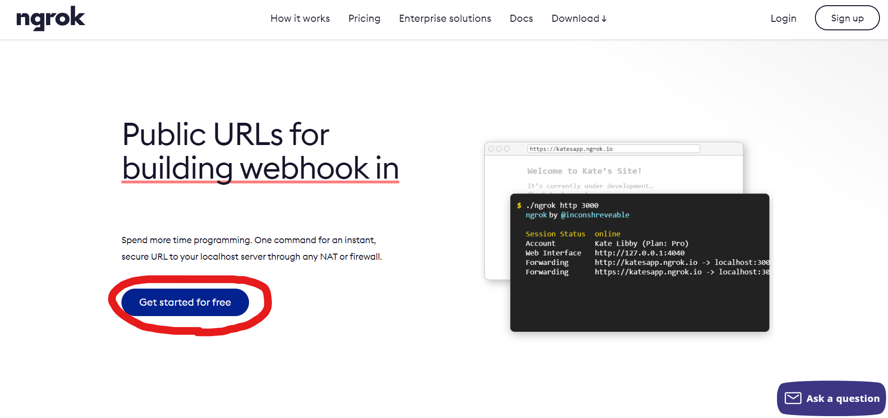

# Day 28 : 撰寫LineBot，利用短短三天認識自動化機器人(中)

今天就來實際撰寫LineBot囉~

我們要先下載必要套件，linebot-sdk以及flask。主要是用flask這種小型框架來做API串接:

```bash
pip install line-bot-sdk
pip install flask
```

再來建立一個app.py的檔案，開始撰寫程式，起手式先這樣:

```python
import os
from flask import Flask, request, abort
from linebot import (
    LineBotApi, WebhookHandler
)
from linebot.exceptions import (
    InvalidSignatureError
)
from linebot.models import *

app = Flask(__name__)

line_bot_api = LineBotApi("")
handler = WebhookHandler("")

@ app.route("/callback", methods=['POST'])
def callback():
    # get X-Line-Signature header value
    signature = request.headers['X-Line-Signature']
    # get request body as text
    body = request.get_data(as_text=True)
    app.logger.info("Request body: " + body)
    # handle webhook body
    try:
        handler.handle(body, signature)
    except InvalidSignatureError:
        abort(400)
    return 'OK'

if __name__ == "__main__":
    port = int(os.environ.get('PORT', 5000))
    app.run(host='0.0.0.0', port=port)
```

這個程式碼的寫法主要是flask框架的寫法，前面先import套件並且設定程式進入點以及一些東西，再來我們在"/callback"這個子網頁設定一些必要的東西，最後在5000port啟動這個程式。

有看到WebhookHandler("")跟LineBotApi("")嗎，這兩個分別是放你頻道的"身分證"，Line要跟程式連結需要這兩個東西才能知道要連到哪隻Linebot，這個部分可以從[昨天的網站](https://developers.line.biz/console/)找到:

- **Channel access token:**(選取自己的機器人→Messaging API→Channel access token)

沒有的話記得按一下issue

- **Channel secret:**(選取自己的機器人→Basic settings→Channel secret)


把它們分別打入LineBotApi跟WebhookHandler裡面。


再來我們先在程式碼中增加這個函式:

```python
@ handler.add(MessageEvent, message=TextMessage)
def handle_message(event):
    if event.message.text =='a':
        msg = (TextSendMessage(text='這是測試'))
        line_bot_api.reply_message(event.reply_token, msg)
```

TextMessage就是文字訊息的意思，這個部分專門傳送文字訊息，圖片等等的也可以參照[官方文件](https://developers.line.biz/en/reference/messaging-api/)做出類似的效果，這邊先只講文字的部分。

event.message.text就是這個事件的文字訊息，也就是使用者的輸入，如果使用者輸入a，我就將TextSendMessage(要傳出的值)設定為'這是測試'並且保存到msg這個變數，再用line_bot_api.reply_message將這個變數的值發出去。這部分稍微理解後我們就可以來實際測試了，我們要讓我們的程式到一個公開的網址上運作所以我們需要ngrok。

## ngrok

ngrok是一個可以讓內部網路與外部溝通的一個工具，這個東西可以將你電腦中的port給予一個網址去做連線。要使用這個服務要先去[官網](https://ngrok.com/)下載他們的程式:




登入帳號後就下載，解壓縮就好了。應該會得到一個ngrok.exe的檔案，把它丟到你的程式資料夾中。

再來就要來開port了!看了一下程式碼撰寫的是5000port，所以ngrok需要開5000port，我們先到程式資料夾中開啟cmd(在箭頭處輸入cmd)。


在cmd中輸入python app.py(代表用python啟動我們撰寫的程式)。


這樣就代表程式正在5000port執行囉!再來我們打開ngrok，輸入ngrok http 5000(代表使用5000port做ngrok服務)。


Forwarding後面的網址就是他幫你開的網址，把這網址丟到Webhook URL:(自己的機器人→Messaging API→Webhook URL)，點擊Edit就能設定了，記得網址要是**https:**開頭，而且因為我們剛剛設定在/callback下做事，所以我們要在網址後面加上/callback，然後將Use webhook打開，按下Verify測試，如果有出現下圖的Success字樣就是沒有問題了。


往上滑有個QRCode，可以先掃加入好友。然後我們往下滑到Auto-reply messages，點進Edit，把Greeting message改成Disabled，Webhooks確定要為Enabled，以防萬一先把Auto-response改成Disabled(理論上沒什麼差)。


就可以去跟機器人私聊，發現他真的會回你話了!


明天就繼續LineBot的部分吧，把我有用到的功能全部打上來做紀錄。