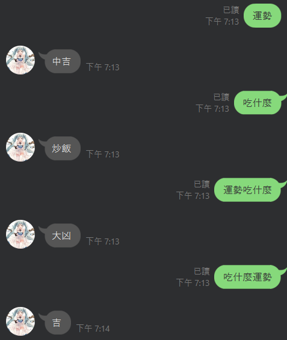
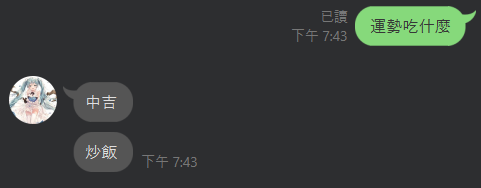
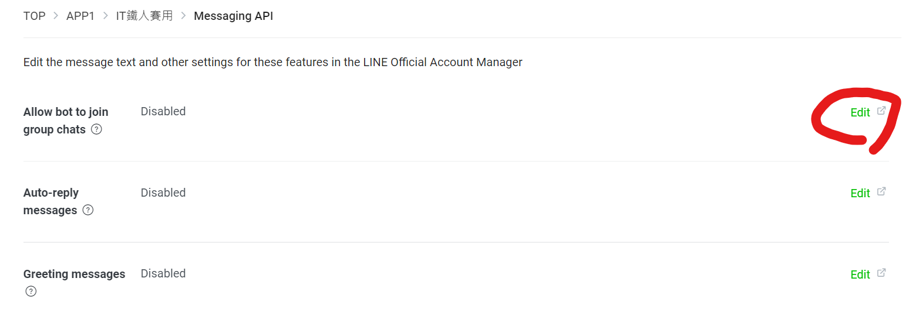
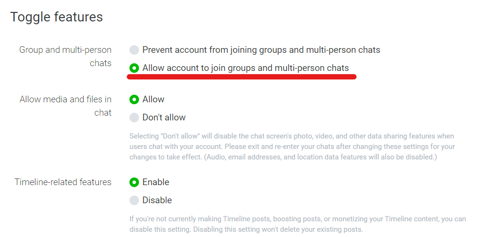

# Day 29 : 撰寫LineBot，利用短短三天認識自動化機器人(下)

今天來繼續接著昨天的LineBot。我們昨天講到，我們可以使用ngrok來讓程式連上公開網路，也就是說，整個flask框架是連上網路的，所以flask可以做到的東西基本上都可以讓LineBot運作，所以Python能做到的爬蟲等功能LineBot也能做到。

我們來幫昨天的程式碼加點東西吧，我想弄兩個抽籤功能，所以我將程式碼改成這樣:

```python
import random #加到第一行
@ handler.add(MessageEvent, message=TextMessage)
def handle_message(event):
    if "運勢" in event.message.text:
        fortune = random.choice(['大凶', '凶', '末吉', '吉','中吉','大吉'])
        line_bot_api.reply_message(event.reply_token, TextSendMessage(text=fortune))  
    if "吃什麼" in event.message.text:
        eat = random.choice(['水餃', '小7', '火鍋', '炒飯','拉麵','陽春麵'])
        line_bot_api.reply_message(event.reply_token, TextSendMessage(text=eat))
```

我使用了Random函式，設定如果使用者輸入有運勢包含在輸入內，就會在下面的串列中隨機挑一個

元素輸出。開啟ngrok做測試，記得每一次測試ngrok的網址都會換，記得要去Webhook URL裡面改網址。



分開是沒問題的，可是當兩個選項都符合時，cmd會報錯加上機器人只會回你第一個判斷式的結果。這是因為line_bot_api.reply_message()這個函式只會使用一次，第二次會因為使用過了所以不執行並且報錯。這有一種方法可以解決，那就是將line_bot_api.reply_message()裡面的元素當成串列資料，再把每一次的結果用append的方式存到這個陣列中一起傳出，具體程式碼長這樣:

```python
@ handler.add(MessageEvent, message=TextMessage)
def handle_message(event):
    msg = []
    if "運勢" in event.message.text:
        fortune = random.choice(['大凶', '凶', '末吉', '吉','中吉','大吉'])
        msg.append(TextSendMessage(text=fortune))
    if "吃什麼" in event.message.text:
        eat = random.choice(['水餃', '小7', '火鍋', '炒飯','拉麵','陽春麵'])
        msg.append(TextSendMessage(text=eat)) 
    line_bot_api.reply_message(event.reply_token, messages=msg[:2])
```



這樣機器人就可以正常運作了~

再來一定有人想過如果這個機器人在群組裡面，會不會也可以達成同樣的作用呢?答案是可以的，機器人不管在私聊或群通有著一樣的效果，不過要邀請機器人到群組我們需要將Messaging API設定中的Allow bot to join group chats調成啟用，點進Edit後調整Toogle features中的Group and multi-person chats:





這樣就可以將機器人邀進群組了!

既然講到群組了一定有人會想說可不可以針對不同人來撰寫特定的程式碼，讓不同人講同樣的話會有不同的回應，或是特定的人講話才會有回應等，這部分當然是可以的，我們只要知道每個人的**User ID**就好了，那這部分要怎麼取得呢，這之間要有個動作，也就是對方講話的時候，我們就可以用特定函式取得他的User ID:

```python
UID = event.source.user_id
```

我們在函式最前面加上這行，利用event.source.user_id可以取得使用者ID。利用event.source.user_id還可以幫你取得當前講話的帳號名字，大頭照位置以及個人介紹。

```python
if event.message.text == 'UID':
        msg.append(TextSendMessage(text=line_bot_api.get_profile(UID).display_name+':\n'+'你的UID為:' + UID))
    if event.message.text == 'UID':
        msg.append(TextSendMessage(text='你的大頭貼圖片位置:'+line_bot_api.get_profile(UID).picture_url))
    if event.message.text == 'UID':
        msg.append(TextSendMessage(text='你的個人介紹:'+line_bot_api.get_profile(UID).status_message))
```

這邊有三個功能:

**line_bot_api.get_profile().display_name:**取得指定User ID的名字

**line_bot_api.get_profile().picture_url:**取得指定User ID的圖片位置

**line_bot_api.get_profile().status_message:**取得指定User ID的個人簡介

參數放的都是發訊息那個人的UID，所以我放入前面的UID變數。

```python
line_bot_api.reply_message(event.reply_token, messages=msg[:5]) #改成:5
```

記得要把陣列範圍條大再進行測試:


這樣就可以同時取得這個人的UID以及他的其他資訊了!也可以利用print功能來將使用者說的話顯示在cmd上，就可以做到聊天紀錄備份的功能。

```python
print(f'{UID}說:{event.message.text}')
```


對了，有User ID，那有沒有Group ID?當然是有，用的是**event.source.group_id**這個功能。利用判別Group ID也能讓不同群組的指令有不一樣的變化。像是之前我就有實際測試一種方案，就是利用push_message的形式，這個發送訊息的模式是主動的，不需要有人傳訊息才會發送:

```python
line_bot_api.push_message('別群的Group ID',TextSendMessage(text=event.message.text))
```

大概長得像這樣，使用**line_bot_api.push_message()**這個函式達到自動推送，參數就放想發送的群組的Group ID，後面放的是想發送的訊息，這是拿來幹嘛的呢?就是將群組的訊息，備份到這個群組內，可是最後我不用這方法了，原因是因為這種推送訊息普通帳號一個月只能發送500則，對於群組訊息真的是不夠用，所以建議要做到這種訊息備份比較好的做法是用前面的方法抓到本地再處理成文字檔。

LineBot還可以發送各種不同的訊息，單純用Python的功能也可以放入各種功能(例如爬取指定網站資料或是將使用者的圖片本地端用PIL處理完後再發送回去等)。以上就是我的LineBot介紹，希望這三篇可以讓各位對於LineBot有簡單的認識，關於其他訊息發送(圖片、影片等)可以多參考研究官方文件，因為本人沒用到所以不熟，就不多做介紹了。明天就來把最後的結語以及在這鐵人賽過程中的心得、期許講出來吧!