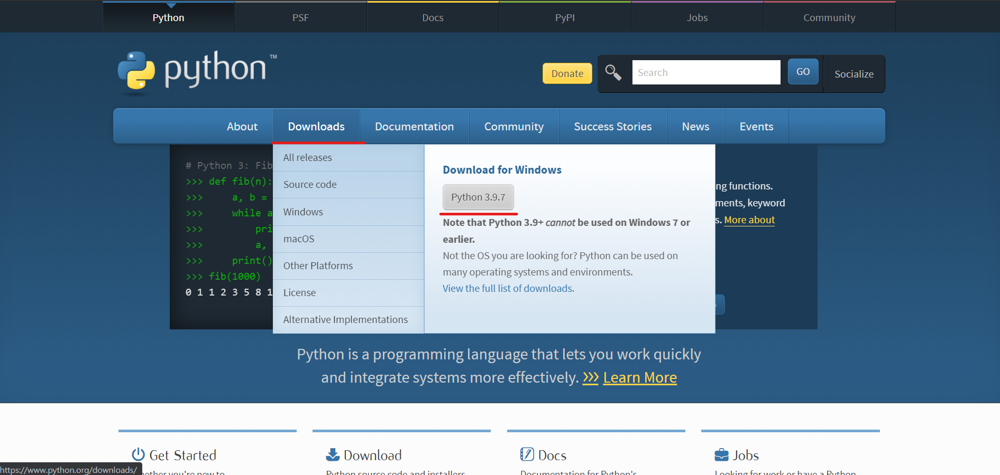
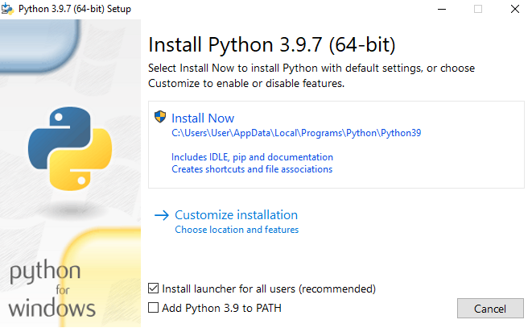
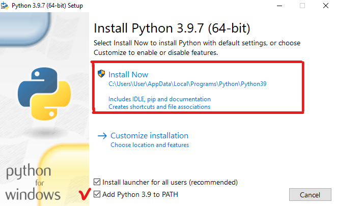
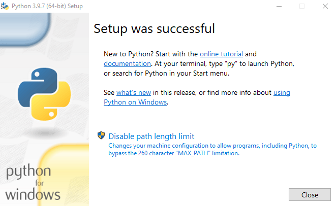
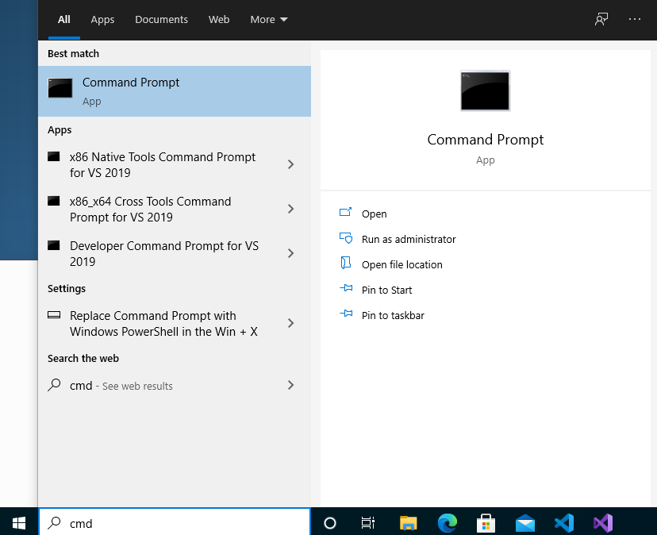
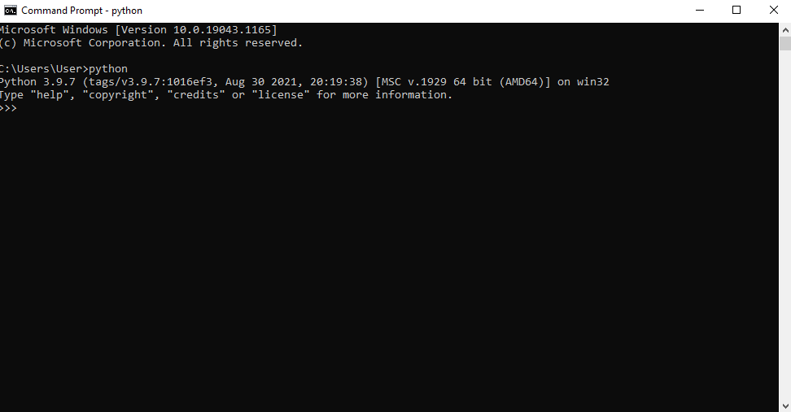
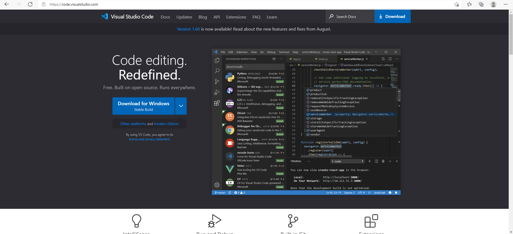
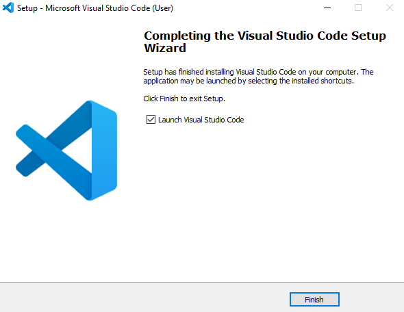
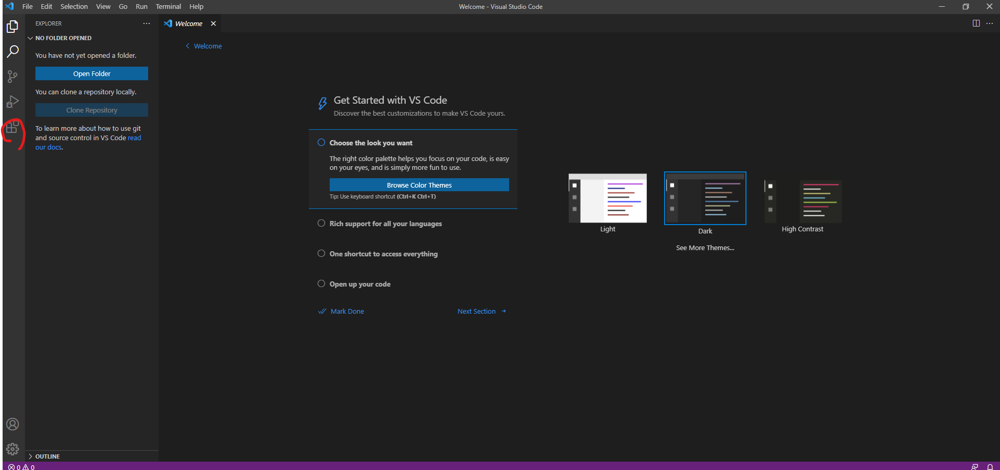
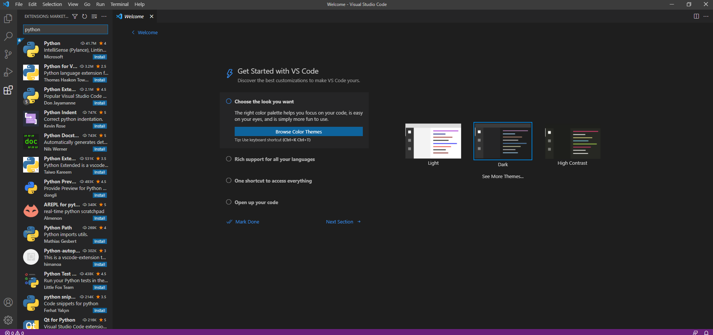

# Day 2 : 建立Python開發環境吧(Windows)!

### 工欲善其事，必先利其器。今天就來安裝最簡易的Python環境吧!廢話不多說，直接來開始。

在撰寫程式上，我們需要兩個最核心的東西，也就是程式語言本體的開發環境，沒有這個就別想運行Python文件，再來就是好的文字編輯器，這邊會介紹**Visual Studio Code**來做為文字編輯器。

## 開發環境安裝

我們先來安裝開發環境吧，我們來到[Python官網](https://www.python.org/)，可以從Downloads裡面的Download for Windows中下載，直接給他按下去。

下載完畢後執行，就可以開始安裝了。

將**Add Python 3.9 to PATH**勾選起來，並且按下**Install Now**，這部份讓安裝環境變得更簡單，不用去設定一些環境變數等，省去了很多麻煩。

看到這樣的畫面就好了，按Close，然後來到電腦搜尋那邊，找到Cmd。

Cmd(命令提示字元)可以用來執行一些Windows指令，打開它並且在裡面輸入**python**，若看到這樣的畫面那就代表已經成功了喔!

## 文字編輯器安裝

再來我們需要一款好用的文字編輯器，專門給程式語言的文字編輯器非常多，這邊我推薦**Visual Studio Code**，除了輕量這個優點外，支援廣、擴充功能多、自訂性高等也都讓它成為大部分使用者愛用的文字編輯器。

來到[官網](https://code.visualstudio.com/)，按下Download for Windows就可以開始下載。

下載完後執行，安裝過程中也不用調整甚麼東西，一直下一步就好。

安裝完後就把它開起來吧。

左邊這個擴充功能的圖示按下去，為了讓**Visual Studio Code**可以獨立運行Python文件，我們需要安裝Python的擴充模組。

搜尋python後，找到**Python**按下Install後就好了!

以上動作做完就能準備開始撰寫程式了，不過基於越來越多人開始用Linux，明天會先介紹Linux的安裝過程。