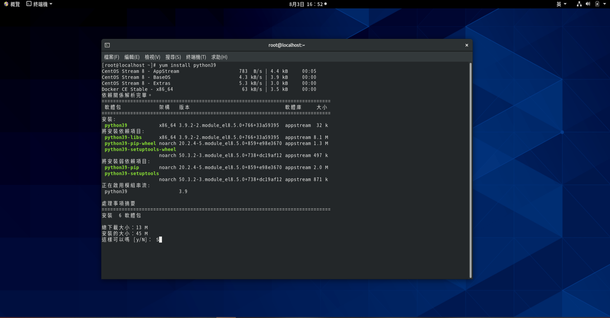
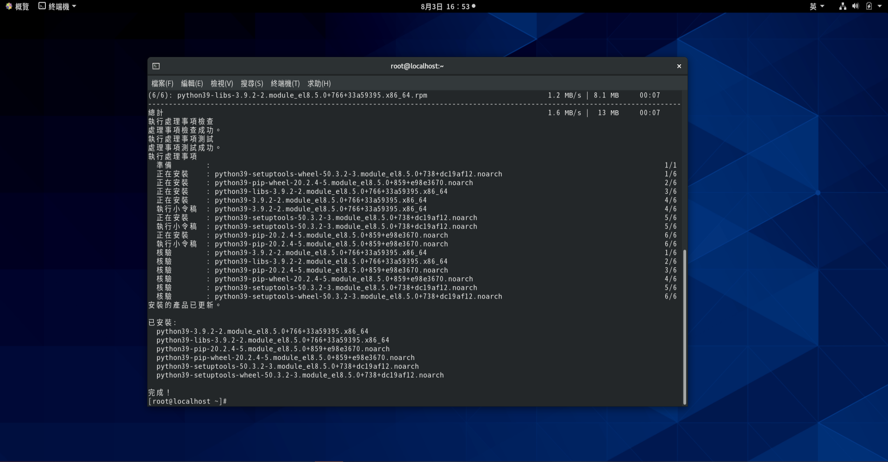
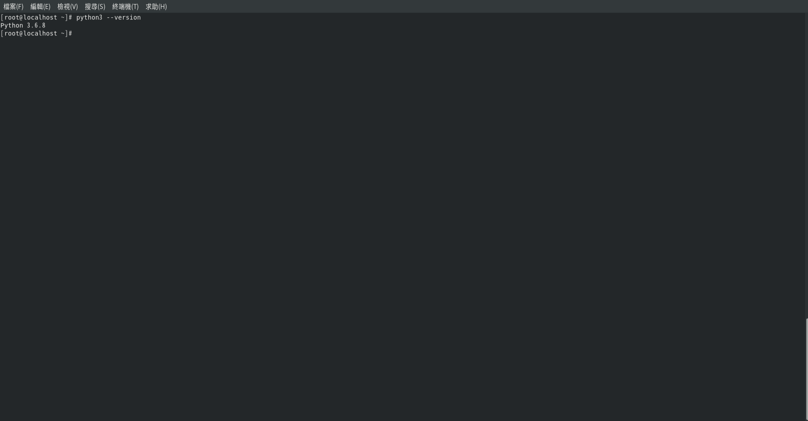
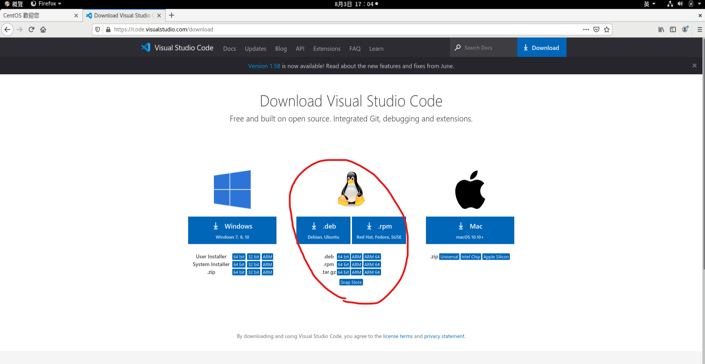
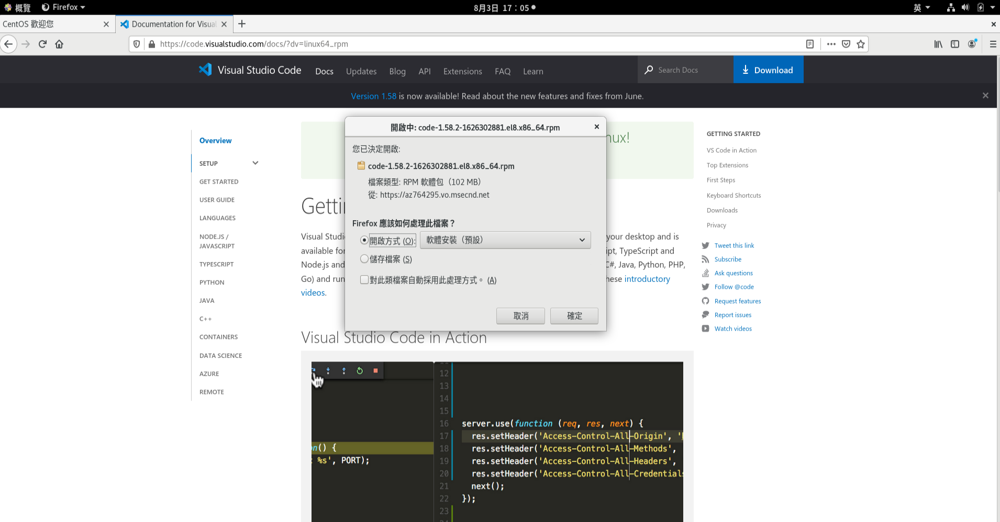
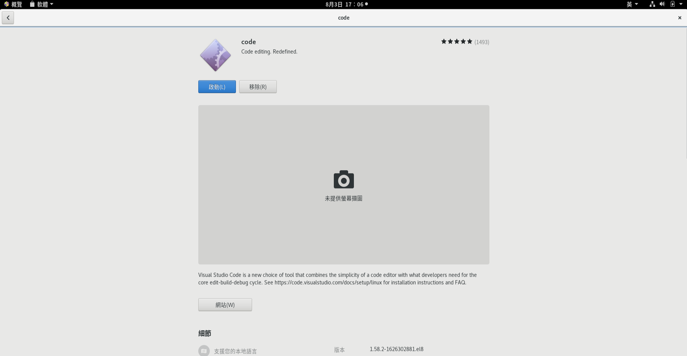
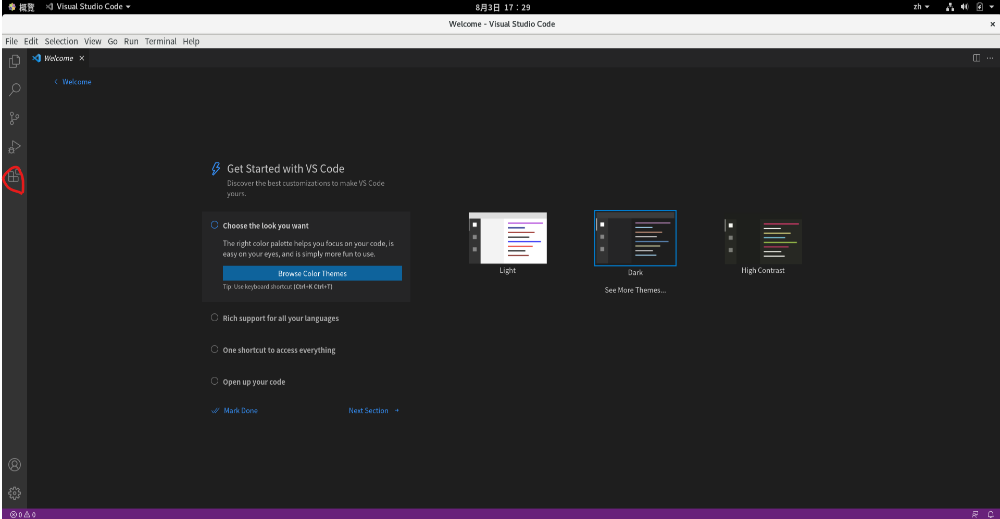
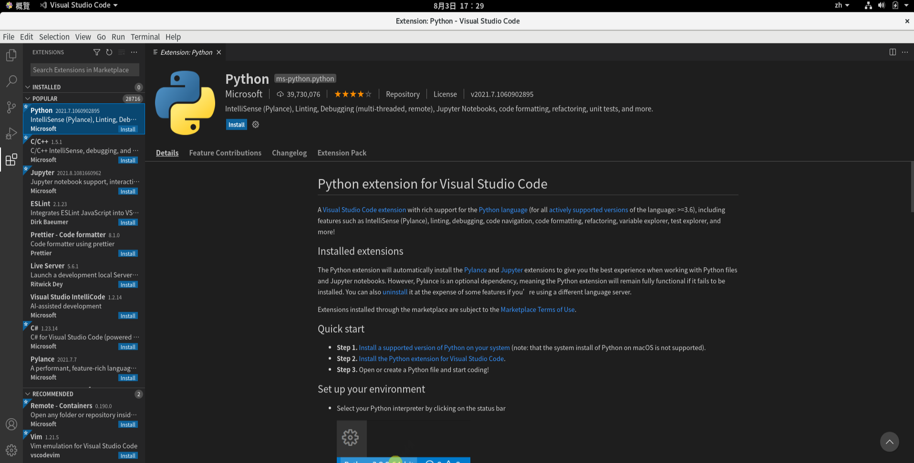

# Day 3 : 建立Python開發環境吧(Linux)!

現在越來越多人使用Linux系統，所以今天會來介紹一下在Linux上使用終端機安裝Python的方法，以及安裝Visual Studio Code的過程~~(雖然沒什麼過程就是了)~~，希望讓對於Linux系統不熟悉的朋友也可以順利安裝Python環境。

***注意:*** 本人是使用CentOS體系，所以使用yum指令來做安裝，若是Debian體系要使用apt指令。

## 開發環境安裝

打開終端機，輸入以下指令:

```bash
yum install python39
```



輸入**y**同意下載Python。



完成後可以輸入**python3 - -version**來看安裝的版本號，若像下圖一樣可以顯示出版本號那就是成功了。



## 文字編輯器安裝

再來我們來安裝Visual Studio Code。

開啟瀏覽器，到[Visual Studio Code官網](https://code.visualstudio.com/)的下載頁面，根據自身作業系統來安裝指定的安裝包







安裝完就可以啟動了，是不是很簡單呢~~(廢話~~

啟動Visual Studio Code後就是下載Python擴充模組的部分了，這部分跟Windows一樣，應該不用多作說明。





到此前置作業就做完了，明天就可以正式開始Code了!

等等，你說有些人不會用Visual Studio Code?那明天就先來介紹一下Visual Studio Code吧!