# Day 4 : VScode-一款多功能的文字編輯器

在撰寫程式語言中，我們需要一款好的文字編輯器，幫助我們檢查錯字、排版、甚至是檢查與法上的問題，當然也可以使用記事本撰寫程式，但在上述功能上遜色了許多。接下來我會簡單介紹Visual Studio Code的操作(以下簡稱VSCode)，以及幾個能幫助到使用者的好用擴充模組。

這邊先介紹中文化的擴充套件，如果有看不慣英文的人可以下載一下，這個套件叫做 Chinese (Traditional) Language Pack for Visual Studio Code。

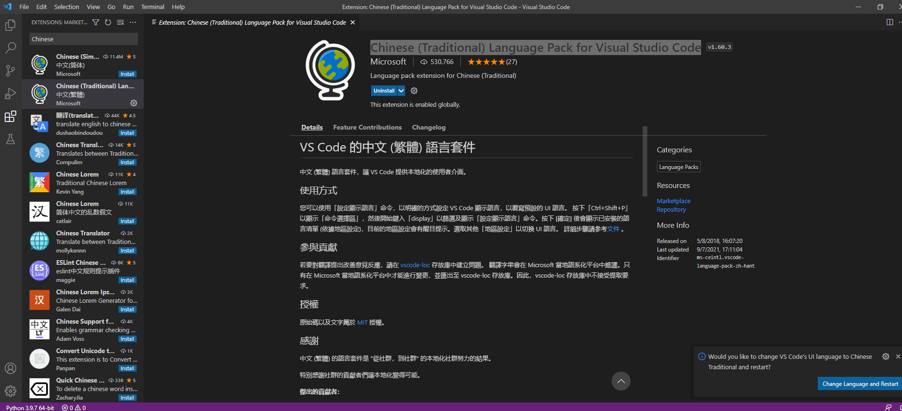

下載完它會叫你重新啟動，重新啟動就會發現介面變成中文的囉!

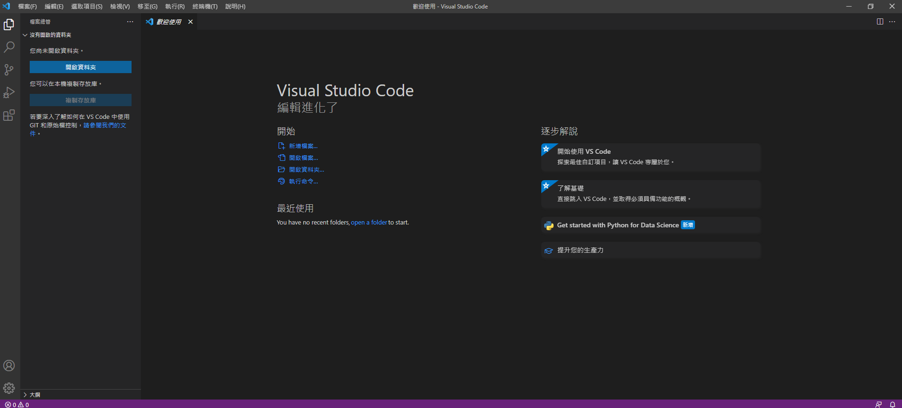

## 基本操作

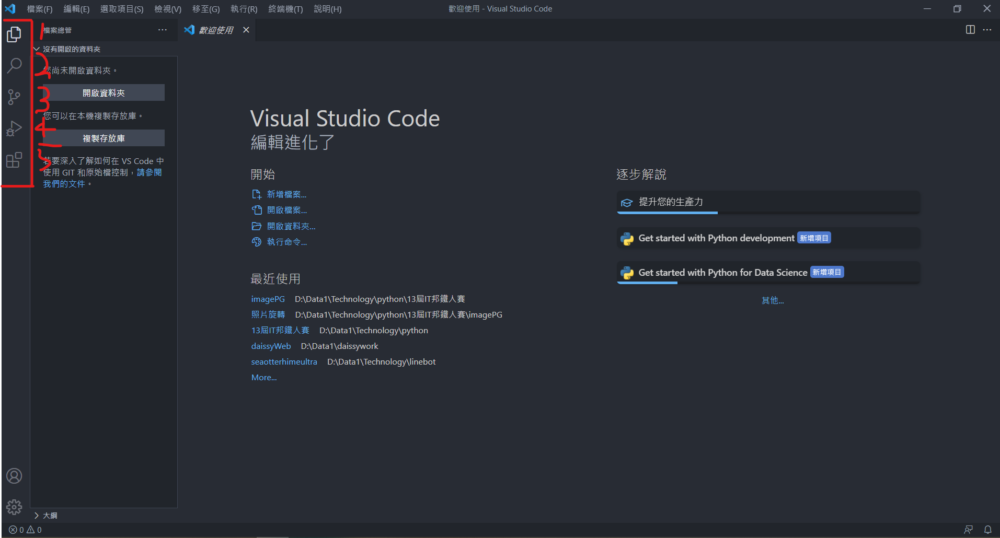

### 1.檔案總管:

點下去就會出現旁邊的區域，叫你開啟資料夾，這邊如果選擇資料夾就會開啟對應的資料夾，方便在VSCode可以快速編輯很多文件。

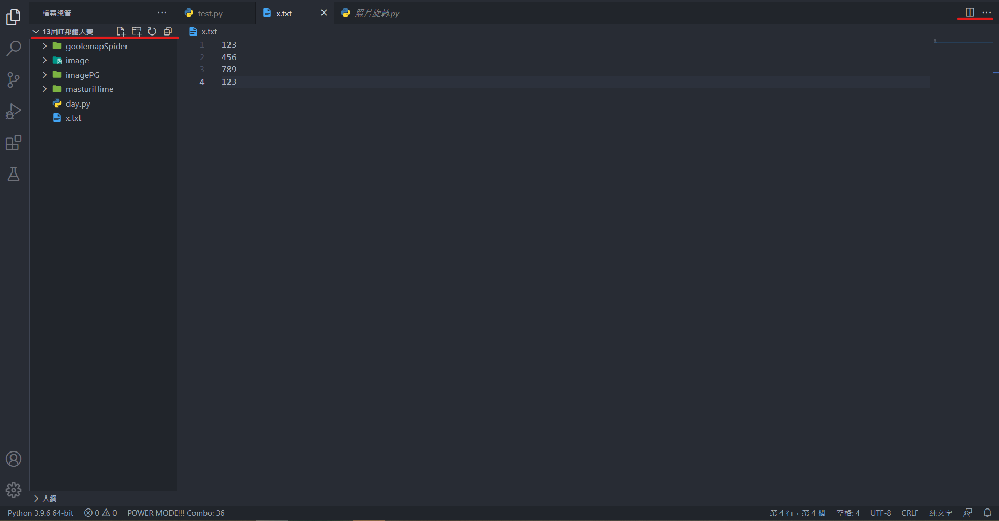

左邊紅線區代表你開啟的資料夾，紅線上的按鈕可以用來建立新資料夾或檔案。右邊的紅線上那個按鈕叫做分割編輯器，它可以把兩個文件並排，方便閱讀，如下:

若你的檔案室可以執行的，而且你又有裝指定模組，右上角就會出現一個箭頭，可以點擊它來執行程式，通常都會使用終端機(Cmd)來執行:

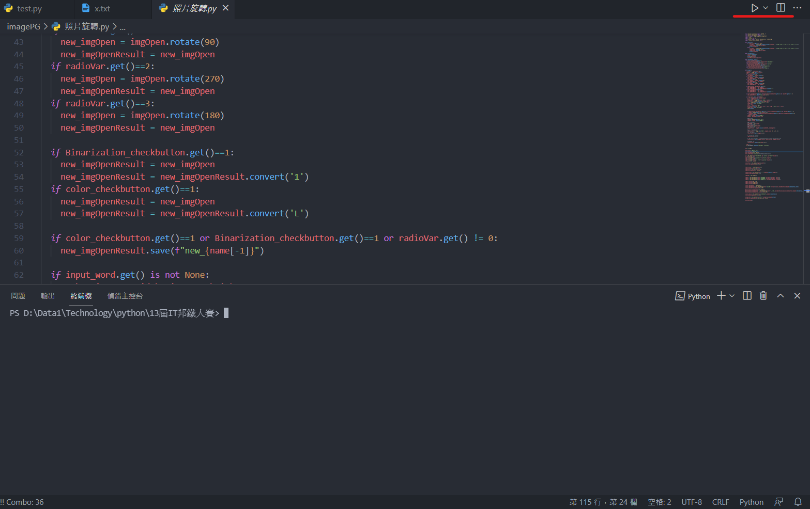

### 2.搜尋

這部分還蠻方便的，若一個文件資料多道你找不到你要的東西，那就可以使用這個功能，打上關鍵字就能找到指定的資料:

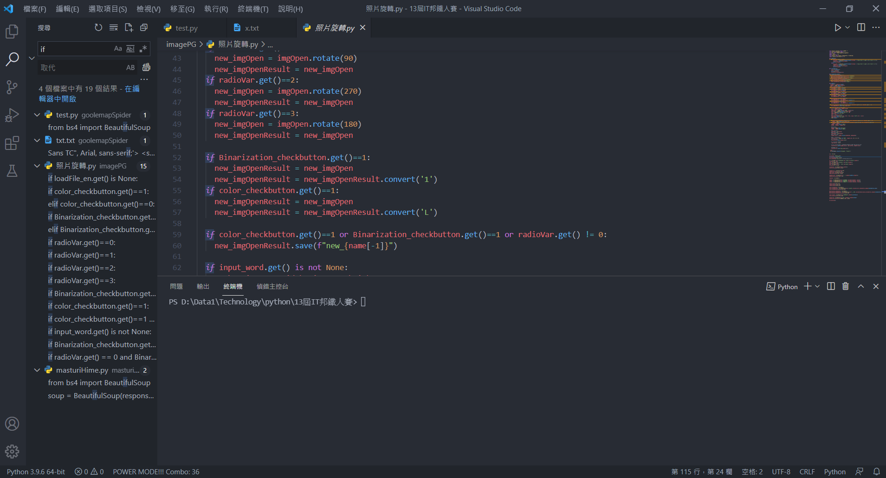

讓我覺得它最方便的是它的取代功能，可以將指定的資料取代成你要的資料，打好要取代的資料跟要取代成什麼後，按下下圖圈起來的那個按鈕就能取代囉!

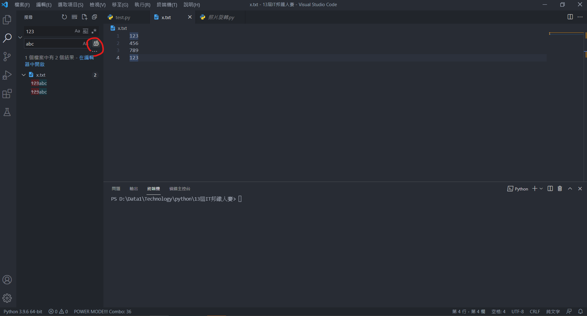

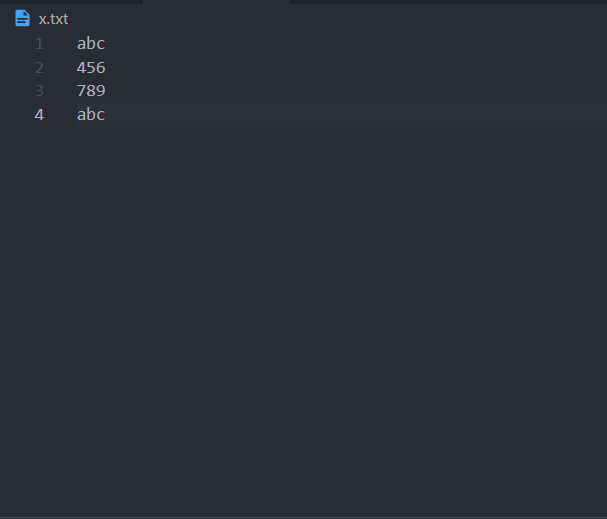

### 3.原始檔控制

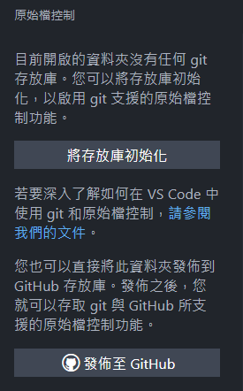

這個部分是專門用來跟git做連結用的，若你的專案有連結git的話，就能在上面看到你對檔案的變更。

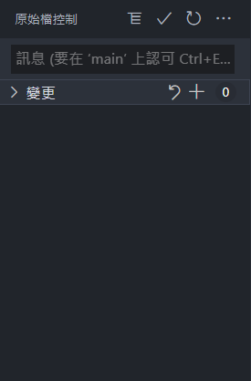

### 4.執行與偵錯

故名思義，可以用來偵錯你程式的bug，看在執行到哪一行會有bug並且回報給你。

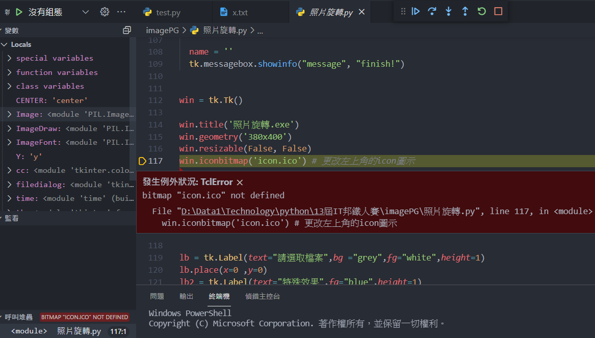

### 5.延伸模組

這部分就是拿來裝擴充功能的地方啦!可以在這邊安裝許多好用的功能等，可以說是vscode的百寶袋，等等會來介紹三個我有在用的，讓畫面變美麗的延伸模組。

## 延伸模組(擴充套件)推薦

### 1.Power Mode

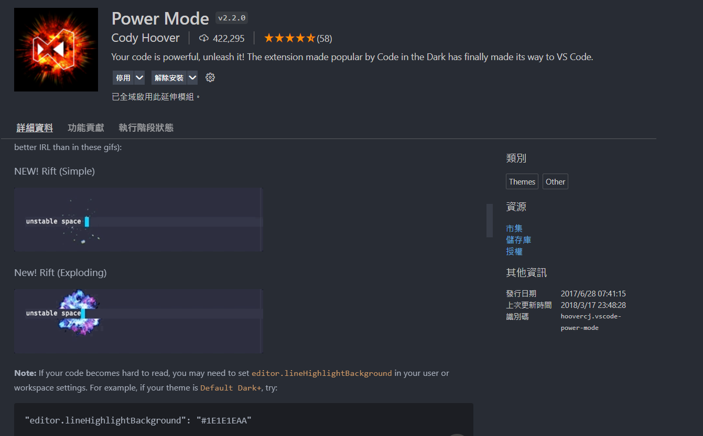

讓你打字會有各種特效的套件

### 2.One Dark Pro

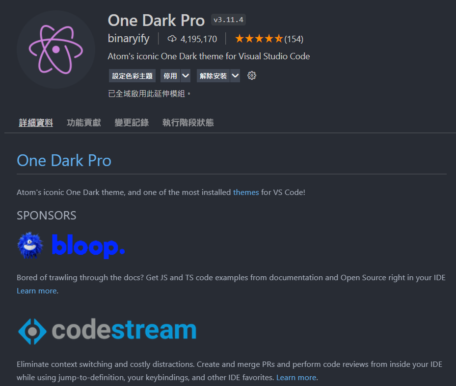

深色模式的加強版，可以讓畫面配色變的更舒服，安裝後點擊設定色彩主題就能調整主題顏色了。

### 3.Material Icon Theme

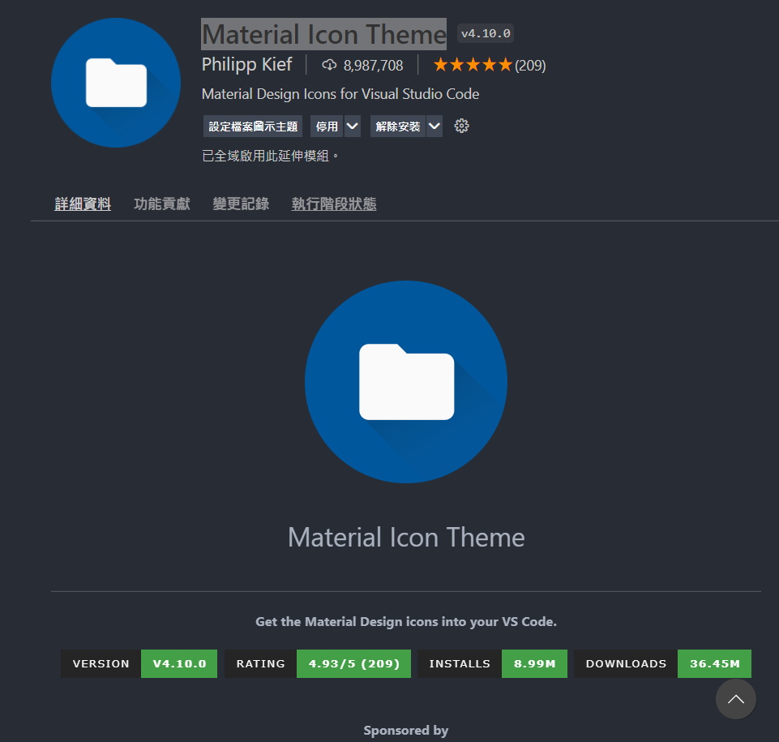

如果看膩原本的圖示的話，可以利用這個套件來調整圖式的樣式。套件內提供了非常多的圖示設定，真的是越看越舒服XD。

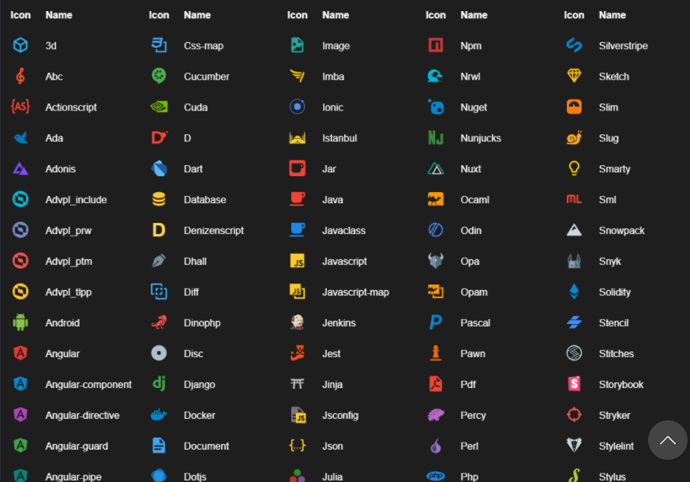

最厲害的是它可以根據你資料夾的名稱改成指定的圖示，以後都不用擔心看錯資料夾了。

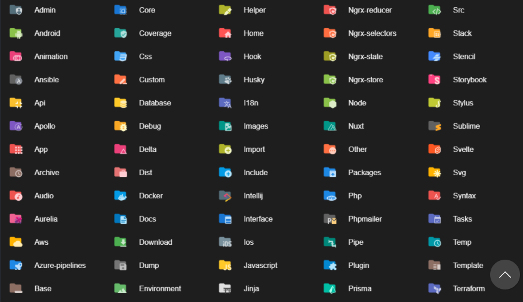

今天介紹了一些vscode的基本操作，明天終於要正式來開始寫程式了!(文章好水ww)