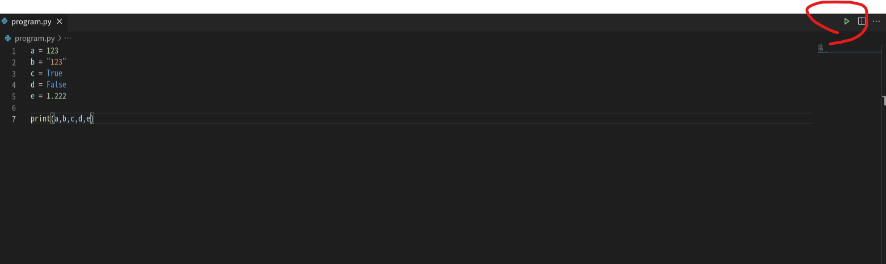

# Day 5 : 基本常識以及變數

今天終於可以開始來學習程式了，在這之前有一些程式語言的基本常識要知道:

## 基本觀念

- **程式的執行**: 程式執行由上至下，由左至右，執行完一行後就換下一行，空行不會影響程式執行，有些例外狀況之後會講到。
- **大小寫區分**: 在Python中，大小寫是有差異的，在撰寫程式碼的時候要特別注意。
- **註解** : 註解會被程式碼忽略，不會執行，主要目的是為了增加一些題示給將來要閱讀程式碼的人，對於維護程式碼有非常大的重要性我們可以使用前面學到的print()來將變數中的值取出。在Python中註解有分單行註解以及多行註解，單行註解會在每一行程式碼後，加上一個'#'，再接註解的內容，'#'後面的文字會被程式忽略，如下:
    
    ```python
    a = 1 #這裡不會執行
    ```
    
    多行註解則是用''' '''來包住想要註解的範圍，可以跨行，如下:
    
    ```python
    a = 1 ''' 這裡面
    					都不會
    						執行 '''
    ```
    
- **縮排** : 很多程式語言都會利用大括弧{}來代表不同的層級，但在Python中並不是這樣，Python中是利用縮排的概念，也就是說，一個空格可能就會讓你的程式出問題，如下:
    
    ```python
    a = 1
      b = 2 #程式碼會報錯
    ```
    

在VSCode中，如果程式有問題會在下方顯示紅色波浪符號。

所以注意縮排是很重要的，那甚麼時候才能不對齊呢，當有層級的概念時就可以，例如判斷式、迴圈，這些後面會提到。

很多人會想說，學程式是不是要從Hello World開始學?那我們來看看下面的程式碼:

```python
print("Hello World")
```


這就是最基本的Hello World，只需要1行便可完成，可以看到這行程式碼的功能是將Hello World這串文字顯示在終端機(Cmd)上，在這行程式碼中可以學到幾點:

1. print可以拿來顯示文字
2. print後面要接()小括弧，裡面放想要顯示的文字
3. 文字要用""引號包起來

再來就直接進入第一個大主題-變數吧!

## 變數

變數的概念就是將一個值丟給一個自己命名的容器做屯放，下次需要用到這個值時，就可以從這個容器中，取出剛剛存放的值來做使用。

Python的變數簡單明瞭，例如以下程式碼:

```python
a = 123
b = "123"
c = True
d = False
e = 1.222
```

在python中，可以不用定義型態，程式會根據你給的東西自動判別型態，像是第一行a = 123的意思就是將123這個值丟給a這個變數名稱，所以a就會等於123，以此類推，下面會列出幾個比較常見的型態:

**整數型態(int) :** 表示一個整數數值，通常拿來計算。Ex : 100

**浮點數型態(float) :** 表示一個小數數值，通常拿來計算。Ex : 3.1415

**布林值(bool) :** 表示邏輯狀態，只有True(真)，跟False(假)兩種，通常拿來判斷一個邏輯的真假。Ex : True

**字串(str):**  表示一串文字，通常用來顯示，會用單引號''或雙引號""包住。Ex : "這是一個字串"

還有一些串列類型的型態還滿重要的，後面會有兩天專門來講這些類型。

由此可知，我們就可以知道，在上面的例子中，a為int型態、b為str型態、c跟d都是bool型態、而e是float型態。

在這上面，a、b、c、d、e就是變數，也就是說將後面的值丟給前面變數存放，並且讓python自動判斷型態。

我們可以使用前面學到的print()來將變數中的值取出，顯示到終端機上，我們輸入以下程式:

```python
a = 123
b = "123"
c = True
d = False
e = 1.222
print(a,b,c,d,e)
```

存檔後，點擊右方的執行鍵就可以執行你的程式囉!



執行後下面就會跳出終端機來顯示你的程式執行結果，執行結果應該長這樣


這邊又學到了一點:print()的括弧中如果要同時print兩個以上的值，需要用逗號隔開。

話說python的判斷型態有的時候會帶來十分麻煩的後果，所以也要順便學一下強制定義型態。


可以在數值前面加個你想要的型態，並且用括弧包住值，就可以達到強制定義型態的功能囉!像是下面這樣:

```python
a = int(123)
b = str("123")
c = bool(True)
d = bool(False)
e = float(1.222)
```

之後我們可以利用type()來得到此變數目前的型態，再用print顯示出來。加入以下程式碼:

```python
print(type(a))
print(type(b))
print(type(c))
print(type(d))
print(type(e))
```


就可以顯示出所有的型態囉!