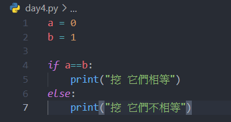
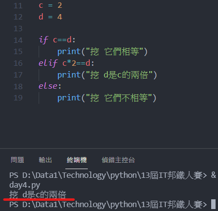

# Day 6 : 數學運算與邏輯判斷

今天將會介紹程式中的數學運算，並且學習python的邏輯判斷。

# 數學運算

Python也可以拿來當計算機，以下就先來介紹Python的算術運算子:

+ : 除了拿來運算數值的加法外，還可以用來拼接字串，EX:

```python
a = 1000
b = 102.45
c = '這是'
d = 'Python的字串拼接'

print(a+b) #1102.45
print(c+d) #這是Python的字串拼接
```

- : 用來做數值的減法

* : 用來做數值的乘法，可以用來複製字串，EX:

```python
a = '複製三遍'

print(a*3) #複製三遍複製三遍複製三遍
```

/ : 用來做數值的除法

// : 用來求數值的商，EX:

```python
a = 10
b = 3

print(a//b) #3
```

% : 用來求數值的餘數，EX:

```python
a = 10
b = 3

print(a%b) #1
```

** : 用來求數值的次方，EX:

```python
a = 5
print(a**2) #求5的二次方，輸出為25
```

# 邏輯判斷

在程式語言中，很常會遇到"判斷"這件事情，例如判斷兩個變數有沒有相同，相同就做某件事情之類的，那若我們要寫判斷式需要怎麼寫呢，這時候就要用到If這個功能了。下面就來看幾個簡單的例子:



我讓a這個變數等於0，b等於1，並且使用if來判斷是否相等，若相等就會進入if，回傳"挖 它們相等"，若不相等就會進入else，回傳"挖 它們不相等"，結果應該大家都知道了


挖 他們不相等(廢話)

我們可以發現幾件事情:

首先，判斷式從if起頭，後面空一格後接著判斷的條件，並且判斷要用兩個等號來表示，並且後面接著一個冒號。記得前面提到的層級關係嗎，判斷式也適用，所以必須縮排(層級關係其實就是大括號，Python省略了大括號所以必續用縮排的方式代表。)，縮排後要放的就是條件成立後要做的事情。

若不符合此條件要做別的事情的話，需要使用else，else就是其它的意思，因此，else在同意層級只能存在一個。

有些人就會問說，如果有很多條件該怎麼辦，一直if下去嗎?

是可以這樣啦，不過個人比較建議利用elif來做條件選擇，如下:



程式由上至下，由左至右執行，所以當看到if不成立時，會判斷elif，結果發現成立，印出"挖 d是c的兩倍"。

話說，判斷式只能用==判斷嗎?當然不是，以下會列出常見的判斷運算子，並舉幾個例子說明:

== :相等

!= :不相等

>=:大於等於

<=:小於等於

又會有人問了，如果我要判斷兩個以上的條件該怎麼辦呢，要寫一堆判斷式一層一層判斷嗎?

當然，你可以這樣做，可是這樣不僅會讓程式碼繁雜，對於電腦也是不好的，所以這時候就需要用到邏輯閘的概念了。

# 邏輯閘

邏輯閘本身是用在電晶體上，藉由電晶體開關的組合來達到一些功能，下面會介紹對於python比較重要的三個邏輯閘:

### NOT


NOT其實就是反向的意思，輸入給1，輸出就為0，反之。

### OR


OR代表者當輸入有一個1時，輸出就必為1，意思是輸入要全為0，輸出才會為0，類似加法的感覺。

### AND


OR代表者當輸入有一個0時，輸出就必為0，意思是輸入要全為1，輸出才會為1，類似乘法的感覺。

你一定會想問，我學這實體的東西要幹嘛，我不是在寫程式嗎，下面直接拿一個例子來讓讀者看看邏輯閘概念在程式上的應用。

```python
a = 1
b = 1
c = 0
if a==b and a==c:
	print("OAO")
else:
	print("OuO")
```

這時候，AND就發揮作用了，有人知道會輸出什麼嗎?

答案是會輸出"OuO"，原理如下:

判斷式a==b成立，輸出為1，可是後面利用一個AND做判斷，所以當整句判斷是有輸出為0(不成立)時，整個輸出就會為0(不成立)，因此，a==c不成立，輸出為0，整個輸出為0，所以條件不成立，程式就跳過if去做else了。

我們再看一個例子

```python
a = 1
b = 1
c = 0

if a == b or a != c:
	print("OAO")
else:
	print("OuO")
```

a == b成立，輸出為1，a != c成立，輸出為1(因為a的確不等於c)，利用or判斷，有一個1則輸出為1，所以理所當然的在if中判斷正確，輸出為"OAO"。