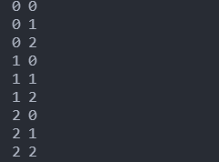

# Day 7 : 迴圈-用來解決重複的事情

今天要來學習程式語言中非常重要的一個概念(功能)-迴圈，迴圈到底可以拿來幹嘛呢?先來看個例子:

如果我想print出1到5的數字的話，沒學過迴圈的人會這樣打:

```python
print(1)
print(2)
print(3)
print(4)
print(5)
```

這樣有點太麻煩了，如果你今天要print1到1000，豈不是要打1000行?所以便有了迴圈的誕生。

迴圈的概念通常都是，當你符合特定條件時，會一直重複做迴圈內的事情，直到條件不符合，便會跳出迴圈。

Python中主要有兩種迴圈，我們先從for開始講起:

# For迴圈

for主要是以範圍來作為判斷條件，語法格式如下:

```python
for 變數 in 範圍:
	要做的事情
```

照慣例直接上範例，比較好理解:

```python
for i in range(1,6,1):
    print(i) #1 2 3 4 5
```

上圖的例子會print出1到5。

先來解釋一下range的用法，range顧名思義就是"範圍"，range中第一個放的值是初值，第二個值是末值，第三個值是步數，中間都用逗號隔開。像上圖的例子，範圍就是1到6，步數為1，因此，程序流程是這樣的:

i=1 ⇒ print(i) ⇒ i=2 ⇒ print(i) ⇒ i=3 ⇒ print(i) ⇒ i=4 ⇒ print(i) ⇒ i=5 ⇒ print(i)

ㄟ你問為甚麼沒有print出6，那是因為在range的末值為6，所以迴圈判斷不會執行到6，會減1。

這種迴圈也可以用變數替代，讓我們看看別的例子:

```python
a = 10
for i in range(a):
    print(i) #0 1 2 3 4 5 6 7 8 9
#注意:若沒有初值將預設為從0開始，沒有步數會預設為1
```

這個例子的範圍為a，也就是10。

# While迴圈

while主要是以條件來作為判斷條件，可以把它想像成是一種會重複執行的if，語法格式如下:

```python
while 條件:
	要做的事情
```

Ex:

```python
a=0
while a<3:
    print(a) #0 1 2
    a = a+1 
```

我們定義條件為a<3，所以當a<3時會重複執行迴圈，要做的事情為print出a以及將a的值加1，所以a每做一次迴圈就會加1，直到大於等於3不符合條件跳出迴圈。

從上面這堆例子可以發現迴圈有幾個重要的點要記住:

- 迴圈中一定要縮排
- 迴圈條件式後方一定要有冒號

這兩點非常重要，沒做到一定會有報錯。

# 巢狀迴圈

迴圈中有個用法叫做巢狀迴圈，其實就只是將迴圈一層一層的包覆執行而已，如下:

```python
for i in range(3):
    for k in range(3):
        print(i,k)
```

結果長這樣



程序流程是這樣的:

i=0 ⇒ k=0 ⇒ print(i,k) ⇒ k=1 ⇒ print(i,k)  ⇒ k=2 ⇒ print(i,k) ⇒ i=1 ⇒ k=0 ⇒ print(i,k)  ⇒ k=1 ⇒ print(i,k)...........

# break&continue

最後來講講break跟continue吧，這兩個功能有點像，所以放在一起講。

遇到break會直接中斷迴圈，break之後的程式都不會執行，範例如下：

```python
for i in range(5):
    if i ==2:
        break
    print(i) #只會輸出0 1
```

在範圍為5的迴圈內，我寫了一個判斷式判斷，若i=2時，就執行break，所以輸出完0,1後，i =2，break，因此不會執行第三次的print(i)，並且直接結束迴圈。

遇到continue不會中斷迴圈，continue之後的程式都不會執行，有點像跳過某一個條件的感覺，範例如下：

```python
for i in range(5):
    if i ==2:
        continue
    print(i) #只會輸出0 1 3 4
```

上面雖然跟brerak一樣會不執行第三次的ptint(i)，可是因為迴圈不會中斷的特性，所以，迴圈會繼續執行直到超出迴圈的範圍5。

迴圈的介紹就到此結束，明天就來學習串列吧!