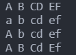
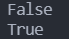
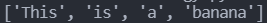

# Day 8 : 字串處理

今天來講講python的字串處理吧，python中字串是一個非常重要的型態，並且python也支援了很多功能，讓我們來看看到底有甚麼實用的功能吧!

## 字串的大小寫處理

python在字串的大小寫處理中給了四個功能，分別是:

- upper() : 將所有字母改為大寫
- lower() : 將所有字母改為小寫
- capitalize() : 將字串中的第一個字母大寫，其餘小寫
- title() : 將每組單詞(空格區分)的第一個字母大寫，其餘小寫

可以打個小程式來測試一下:

```python
a = 'a B cD eF'
print(a.upper())
print(a.lower())
print(a.capitalize())
print(a.title())
```



如果要做大小寫的判斷，我們可以利用islower()、isupper() 來判斷，如下例:

```python
a = 'abcdef'
print(a.isupper())
print(a.islower())
```



可以看到isupper()回傳的是False，因為它並非全大寫，而islower()回傳的是True，因為是全小寫，可以利用這種方式來做邏輯的判斷。

## 字串分割

字串有個非常重要的功能叫做分割，如果有一個字串，你要將其中幾個詞取出來，就會用到split。

```python
a = 'This is a banana'
print(a.split())
```



預設是用空白做切割，所以用串列list回傳四組字串(單字)。

split也可以指定想要切割的字元，以及要切割幾次:

```python
a = 'This/is/a/banana'
print(a.split('/',2))
```


上例就是用/作為分隔符，切割兩次。

## 字串格式化

如果想在字串內回傳變數的值，那就需要用到f字串。用法是在字串前加一個f，並且在字串內想要傳入變數的地方用大括號{}包住，如下:

```python
a = 10
print(f"I have {a} bananas")
```


## 使用者輸入

當系統要跟使用者互動時，很常會讓使用者輸入資料並根據使用者輸入的資料給予相對應的結果，這時候就會用到input()這個函式:

```python
a = input("請輸入:")
print(a)
```

input後面的括號裡面可以放顯示給使用者的訊息。這段程式碼的效果就會像下圖一樣，可以在終端機輸入文字並且回傳。


## 字串的連接

字串可以利用+號連結，以及利用*來增倍:

```python
a = "這是"
b = "字串測試"
print(a+b)
print(a*3)
```


以上就是字串的最基本運用，會這些應該就能做到很多事了